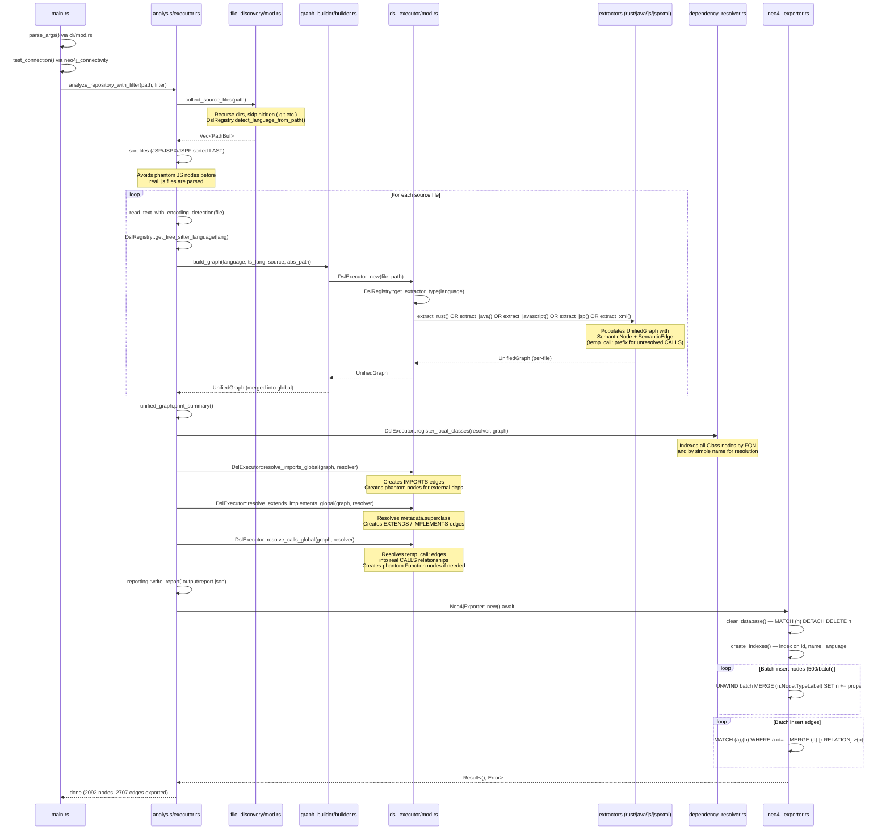
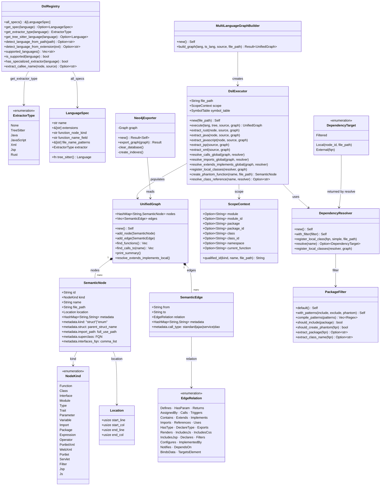
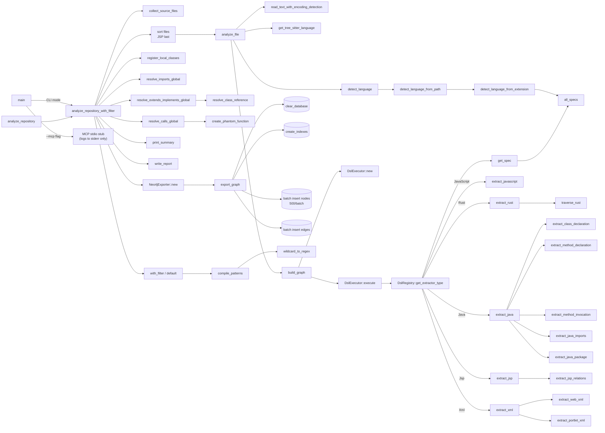
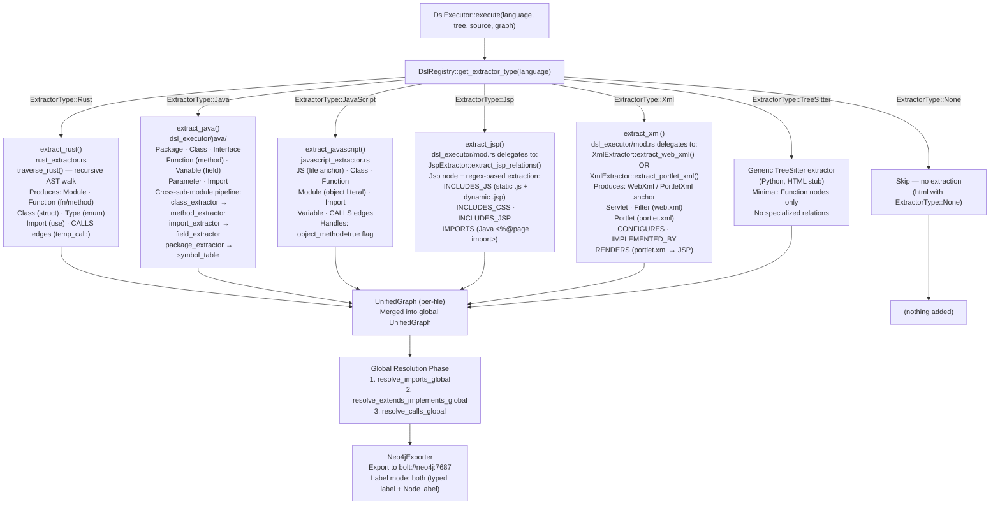

# RETRODOC — code-continuum

> Generated by the retrodoc agent via live Neo4j queries.
> Date: 2026-03-01
> Analyzed source: /workspaces/code-continuum/src (Rust)
> Graph: 2092 nodes · 2707 edges · 171 files analyzed

---

## 1. Project Overview

**code-continuum** is a multi-language static analysis tool written in Rust. It parses source code
using Tree-Sitter, extracts a unified semantic graph (nodes = code entities, edges = relationships),
and exports that graph to Neo4j. A JSON-RPC stdio MCP server (previously `src/mcp/mod.rs`, now
integrated in `main.rs`) exposes two tools — `parse_project` and `execute_cypher` — allowing AI
agents to query the knowledge graph with Cypher.

The self-analysis run on 2026-03-01 processed 171 files across Java, JavaScript, Rust, JSP, and
WebSphere XML, producing 2092 nodes and 2707 edges. Rust source files alone contributed 317
Function nodes, 234 Module nodes, 217 Import nodes, 25 Class (struct) nodes, and 10 Type (enum)
nodes.

The pipeline is designed around a registry pattern: `DslRegistry` maps file extensions and
filename patterns to language-specific extractors (`ExtractorType` enum). Each extractor is
invoked by `DslExecutor::execute()` and populates a per-file `UnifiedGraph`. After all files have
been processed, three global resolution passes resolve cross-file `IMPORTS`, `EXTENDS/IMPLEMENTS`,
and `CALLS` relationships before the unified graph is batch-exported to Neo4j (500 nodes per
batch). This ordering is critical: JSP files are intentionally sorted last during file discovery to
avoid creating phantom JavaScript nodes before real `.js` files have been parsed.

---

## 2. Module/File Hierarchy

```mermaid
graph TD
    subgraph "src/ (entry)"
        main["main.rs"]
        lib["lib.rs"]
        main --> main_fn(main)
    end

    subgraph "src/analysis/"
        executor["executor.rs"]
        analysis_mod["mod.rs"]
        executor --> analyze_repository(analyze_repository)
        executor --> arwf(analyze_repository_with_filter)
        executor --> analyze_file(analyze_file)
        executor --> detect_language(detect_language)
        analysis_mod --> AnalysisReport[AnalysisReport]
        analysis_mod --> FileError[FileError]
        analysis_mod --> ParseError[ParseError]
    end

    subgraph "src/semantic_graph/"
        sg["semantic_graph.rs"]
        dsl_rs["dsl.rs"]
        neo4j_exp["neo4j_exporter.rs"]
        sg --> SemanticNode[SemanticNode]
        sg --> SemanticEdge[SemanticEdge]
        sg --> UnifiedGraph[UnifiedGraph]
        sg --> NodeKind{NodeKind}
        sg --> EdgeRelation{EdgeRelation}
        sg --> Location[Location]
        dsl_rs --> DslRegistry[DslRegistry]
        dsl_rs --> LanguageSpec[LanguageSpec]
        dsl_rs --> ExtractorType{ExtractorType}
        neo4j_exp --> Neo4jExporter[Neo4jExporter]
        neo4j_exp --> export_graph(export_graph)
    end

    subgraph "src/graph_builder/"
        builder["builder.rs"]
        dsl_mod["dsl_executor/mod.rs"]
        rust_ext["dsl_executor/rust_extractor.rs"]
        js_ext["dsl_executor/javascript_extractor.rs"]
        dep_res["dsl_executor/dependency_resolver.rs"]
        builder --> MGB[MultiLanguageGraphBuilder]
        builder --> build_graph(build_graph)
        dsl_mod --> DslExecutor[DslExecutor]
        dsl_mod --> ScopeContext[ScopeContext]
        dsl_mod --> SymbolTable[SymbolTable]
        dsl_mod --> execute(execute)
        dsl_mod --> extract_rust(extract_rust)
        dsl_mod --> extract_java(extract_java)
        dsl_mod --> extract_javascript(extract_javascript)
        dsl_mod --> extract_jsp(extract_jsp)
        dsl_mod --> extract_xml(extract_xml)
        dsl_mod --> resolve_calls_global(resolve_calls_global)
        dsl_mod --> resolve_imports_global(resolve_imports_global)
        dsl_mod --> resolve_extends_implements_global(resolve_extends_implements_global)
        dep_res --> DependencyResolver[DependencyResolver]
        dep_res --> DependencyTarget{DependencyTarget}
    end

    subgraph "src/graph_builder/dsl_executor/java/"
        java_mod["mod.rs"]
        class_ext["class_extractor.rs"]
        field_ext["field_extractor.rs"]
        import_ext["import_extractor.rs"]
        method_ext["method_extractor.rs"]
        pkg_ext["package_extractor.rs"]
        class_ext --> extract_class_declaration(extract_class_declaration)
        class_ext --> extract_interface_declaration(extract_interface_declaration)
        method_ext --> extract_method_declaration(extract_method_declaration)
        method_ext --> extract_method_invocation(extract_method_invocation)
        java_mod --> extract_java_fn(extract_java)
    end

    subgraph "src/graph_builder/dsl_executor/websphere_portal/"
        jsp_ext["jsp_extractor.rs"]
        xml_ext["xml_extractor.rs"]
        portlet_ext["portlet_extractor.rs"]
        relations_rs["relations.rs"]
        jsp_ext --> JspExtractor[JspExtractor]
        jsp_ext --> extract_jsp_relations(extract_jsp_relations)
        xml_ext --> XmlExtractor[XmlExtractor]
        xml_ext --> extract_web_xml(extract_web_xml)
        xml_ext --> extract_portlet_xml(extract_portlet_xml)
        portlet_ext --> PortletExtractor[PortletExtractor]
        portlet_ext --> extract_portlet_relations(extract_portlet_relations)
        relations_rs --> WebSphereRelation{WebSphereRelation}
        relations_rs --> DaoOperation{DaoOperation}
        relations_rs --> CallsAjaxMetadata[CallsAjaxMetadata]
        relations_rs --> CallsServiceMetadata[CallsServiceMetadata]
        relations_rs --> CallsDaoMetadata[CallsDaoMetadata]
        relations_rs --> RendersMetadata[RendersMetadata]
        relations_rs --> ConfiguresMetadata[ConfiguresMetadata]
    end

    subgraph "src/config/"
        pkg_filter["package_filter.rs"]
        pkg_filter --> PackageFilter[PackageFilter]
        pkg_filter --> with_patterns(with_patterns)
        pkg_filter --> compile_patterns(compile_patterns)
        pkg_filter --> wildcard_to_regex(wildcard_to_regex)
    end

    subgraph "src/file_discovery/"
        fd["mod.rs"]
        fd --> collect_source_files(collect_source_files)
    end

    subgraph "src/neo4j_connectivity/"
        neo4j_conn["mod.rs"]
        neo4j_conn --> test_connection(test_connection)
    end

    subgraph "src/cli/ · src/encoding/ · src/reporting/ · src/ui/"
        cli_mod["cli/mod.rs"] --> CliArgs[CliArgs]
        cli_mod --> parse_args(parse_args)
        cli_mod --> validate_path(validate_path)
        enc["encoding/mod.rs"] --> read_text(read_text_with_encoding_detection)
        rep["reporting/mod.rs"] --> write_report(write_report)
        ui_mod["ui/mod.rs"] --> show_progress(show_progress)
        ui_mod --> show_batch_progress(show_batch_progress)
        ui_mod --> phase_start(phase_start)
    end
```



### Module Inventory

| Module (file) | Functions | Structs (Class) | Enums (Type) | Traits | Imports |
|---|---|---|---|---|---|
| src/analysis/executor.rs | analyze_repository, analyze_repository_with_filter, analyze_file, detect_language | — | — | — | 8 |
| src/analysis/mod.rs | — | AnalysisReport, FileError, ParseError | — | — | 1 |
| src/cli/mod.rs | parse_args, validate_path | CliArgs | — | — | 1 |
| src/config/mod.rs | — | — | — | — | 1 |
| src/config/package_filter.rs | with_patterns, compile_patterns, wildcard_to_regex, extract_package, extract_class_name | PackageFilter | — | — | 2 |
| src/encoding/mod.rs | read_text_with_encoding_detection | — | — | — | 2 |
| src/file_discovery/mod.rs | collect_source_files | — | — | — | 2 |
| src/graph_builder/builder.rs | build_graph | MultiLanguageGraphBuilder | — | — | 4 |
| src/graph_builder/dsl_executor/mod.rs | execute, extract_rust, extract_java, extract_javascript, extract_jsp, extract_xml, resolve_calls_global, resolve_imports_global, resolve_extends_implements_global, create_phantom_function, resolve_class_reference | DslExecutor, ScopeContext, SymbolTable | — | — | 9 |
| src/graph_builder/dsl_executor/dependency_resolver.rs | new, with_filter, register_local_classes, resolve | DependencyResolver | DependencyTarget | — | 2 |
| src/graph_builder/dsl_executor/java/class_extractor.rs | extract_class_declaration, extract_interface_declaration, extract_class_inheritance_metadata, resolve_via_imports | — | — | — | 4 |
| src/graph_builder/dsl_executor/java/field_extractor.rs | extract_field_declaration, extract_formal_parameter, extract_local_variable_declaration | — | — | — | 4 |
| src/graph_builder/dsl_executor/java/import_extractor.rs | extract_java_imports | — | — | — | 4 |
| src/graph_builder/dsl_executor/java/method_extractor.rs | extract_method_declaration, extract_method_invocation | — | — | — | 5 |
| src/graph_builder/dsl_executor/java/package_extractor.rs | extract_java_package | — | — | — | 5 |
| src/graph_builder/dsl_executor/javascript_extractor.rs | extract_javascript | — | — | — | 5 |
| src/graph_builder/dsl_executor/rust_extractor.rs | extract_rust, traverse_rust | — | — | — | 5 |
| src/graph_builder/dsl_executor/websphere_portal/jsp_extractor.rs | extract_jsp_relations, create_includes_js_relation, create_includes_css_relation, create_includes_jsp_relation, create_imports_relation | JspExtractor | — | — | 6 |
| src/graph_builder/dsl_executor/websphere_portal/xml_extractor.rs | extract_web_xml, extract_portlet_xml, create_servlet_declaration, create_filter_declaration, create_portlet_configuration | XmlExtractor | — | — | 5 |
| src/graph_builder/dsl_executor/websphere_portal/portlet_extractor.rs | extract_portlet_relations, extract_dispatch_calls, extract_string_argument, create_renders_relation | PortletExtractor | — | — | 4 |
| src/graph_builder/dsl_executor/websphere_portal/relations.rs | — | CallsAjaxMetadata, CallsDaoMetadata, CallsServiceMetadata, RendersMetadata, ConfiguresMetadata | WebSphereRelation, DaoOperation, RelationPriority | — | 2 |
| src/semantic_graph/dsl.rs | all_specs, get_spec, get_extractor_type, get_tree_sitter_language, detect_language_from_path, detect_language_from_extension, supported_languages, is_supported, has_specialized_extractor, extract_callee_name, identifier_text | DslRegistry, LanguageSpec | ExtractorType | — | 7 |
| src/semantic_graph/semantic_graph.rs | new, add_node, add_edge, find_functions, find_calls_to, print_summary, resolve_extends_implements_local | UnifiedGraph, SemanticNode, SemanticEdge, Location | NodeKind, EdgeRelation | — | 2 |
| src/semantic_graph/neo4j_exporter.rs | new, export_graph, clear_database, create_indexes | Neo4jExporter | — | — | 4 |
| src/neo4j_connectivity/mod.rs | test_connection | — | — | — | 3 |
| src/reporting/mod.rs | write_report | — | — | — | 1 |
| src/ui/mod.rs | phase_start, phase_complete, show_progress, show_progress_stepped, show_batch_progress, display_progress | — | — | — | 2 |
| src/main.rs | main | — | — | — | 5 |
| src/lib.rs | — | — | — | — | — |

---

## 3. Analysis Pipeline



### Pipeline Steps

1. **CLI parsing** (`cli/mod.rs::parse_args`) — validates the source directory argument
2. **Connectivity check** (`neo4j_connectivity::test_connection`) — fails fast if Neo4j is unreachable
3. **File discovery** (`file_discovery::collect_source_files`) — recursive traversal, skips hidden dirs, uses `DslRegistry` to filter supported extensions
4. **File sorting** (`analysis/executor.rs`) — JSP/JSPX/JSPF files are sorted last to prevent phantom JavaScript node creation
5. **Encoding-aware file reading** (`encoding::read_text_with_encoding_detection`) — auto-detects UTF-8, Latin-1, etc.
6. **AST parsing** — Tree-Sitter parser selected per language via `DslRegistry::get_tree_sitter_language`
7. **Semantic extraction** (`DslExecutor::execute`) — dispatches to per-language extractor, builds per-file `UnifiedGraph`
8. **Global resolution** — three passes: `resolve_imports_global`, `resolve_extends_implements_global`, `resolve_calls_global`
9. **Report writing** (`reporting::write_report`) — emits `.output/report.json`
10. **Neo4j export** (`Neo4jExporter::export_graph`) — clear → indexes → batch nodes (500/batch) → batch edges

---

## 4. Core Data Structures



### Key Types

| Type | Kind | File | Role |
|---|---|---|---|
| SemanticNode | Struct | src/semantic_graph/semantic_graph.rs:9 | Core graph vertex: code entity (function, class, etc.) |
| SemanticEdge | Struct | src/semantic_graph/semantic_graph.rs:76 | Core graph edge: relationship between two nodes |
| UnifiedGraph | Struct | src/semantic_graph/semantic_graph.rs:158 | Container for all nodes and edges across all files |
| Location | Struct | src/semantic_graph/semantic_graph.rs:66 | Source position (line/col start+end) |
| NodeKind | Enum | src/semantic_graph/semantic_graph.rs:21 | 19-variant enum of all node types |
| EdgeRelation | Enum | src/semantic_graph/semantic_graph.rs:86 | 25-variant enum of all relationship types |
| DslRegistry | Struct | src/semantic_graph/dsl.rs:229 | Central registry: language detection + extractor dispatch |
| LanguageSpec | Struct | src/semantic_graph/dsl.rs:95 | Per-language configuration (extensions, parser, extractor) |
| ExtractorType | Enum | src/semantic_graph/dsl.rs:52 | 7-variant enum (None/TreeSitter/Java/JavaScript/Xml/Jsp/Rust) |
| DslExecutor | Struct | src/graph_builder/dsl_executor/mod.rs:127 | Stateful extractor with scope tracking and resolution |
| ScopeContext | Struct | src/graph_builder/dsl_executor/mod.rs:52 | Hierarchical scope: module/package/class/function |
| SymbolTable | Struct | src/graph_builder/dsl_executor/mod.rs:27 | Variable-to-type mapping for type inference |
| MultiLanguageGraphBuilder | Struct | src/graph_builder/builder.rs:9 | Entry point for per-file graph building |
| DependencyResolver | Struct | src/graph_builder/dsl_executor/dependency_resolver.rs:21 | Cross-file class index for FQN and simple-name resolution |
| DependencyTarget | Enum | src/graph_builder/dsl_executor/dependency_resolver.rs:8 | Resolution result: Local/External/Filtered |
| PackageFilter | Struct | src/config/package_filter.rs:7 | Include/exclude patterns for phantom node creation |
| Neo4jExporter | Struct | src/semantic_graph/neo4j_exporter.rs:8 | Batch export of UnifiedGraph to Neo4j via neo4rs |
| JspExtractor | Struct | src/graph_builder/dsl_executor/websphere_portal/jsp_extractor.rs:15 | JSP regex-based extractor (JS/CSS/JSP includes, Java imports) |
| XmlExtractor | Struct | src/graph_builder/dsl_executor/websphere_portal/xml_extractor.rs:15 | web.xml / portlet.xml regex-based extractor |
| PortletExtractor | Struct | src/graph_builder/dsl_executor/websphere_portal/portlet_extractor.rs:20 | Portlet dispatch-mode extractor for RENDERS relations |
| WebSphereRelation | Enum | src/graph_builder/dsl_executor/websphere_portal/relations.rs:14 | WebSphere-specific relation type enum |
| DaoOperation | Enum | src/graph_builder/dsl_executor/websphere_portal/relations.rs:169 | DAO operation classification |
| AnalysisReport | Struct | src/analysis/mod.rs:19 | Pipeline output report (written to .output/report.json) |
| CliArgs | Struct | src/cli/mod.rs:3 | Parsed CLI arguments |

---

## 5. Call Graph



### Entry Points

| Function | File | Description |
|---|---|---|
| main | src/main.rs | Binary entry point: parses CLI args, checks Neo4j connectivity, dispatches to executor or MCP stub |
| analyze_repository | src/analysis/executor.rs | Public API shorthand (no filter): delegates to `analyze_repository_with_filter` |
| analyze_repository_with_filter | src/analysis/executor.rs | Full pipeline: file discovery, extraction, resolution, Neo4j export |

> **Note on MCP:** `src/mcp/mod.rs` is deleted in the current working tree (shown as `D` in git status). The `--mcp` flag branch in `main.rs` currently sets up minimal logging and returns immediately (stub). MCP functionality has been moved to the external `mcp-neo4j` HTTP server visible in `.mcp.json`.

---

## 6. Language Dispatch



### Supported Extractors

| Language | Extensions / Filenames | Extractor | Produced Nodes |
|---|---|---|---|
| rust | .rs | dsl_executor/rust_extractor.rs | Module · Function · Class (struct) · Type (enum) · Import |
| java | .java | dsl_executor/java/ (5 sub-modules) | Package · Class · Interface · Function · Variable · Parameter · Import |
| javascript | .js .jsx .ts .tsx | dsl_executor/javascript_extractor.rs | JS · Class · Function · Module (object literal) · Import · Variable |
| xml | portlet.xml / web.xml | websphere_portal/xml_extractor.rs | WebXml · PortletXml · Servlet · Portlet · Filter + CONFIGURES · IMPLEMENTED_BY |
| jsp | .jsp .jspx .jspf | websphere_portal/jsp_extractor.rs | Jsp + INCLUDES_JS · INCLUDES_CSS · INCLUDES_JSP · IMPORTS |
| python | .py | generic Tree-Sitter (stub) | Function only |
| html | .html .htm | Tree-Sitter (ExtractorType::None) | (nothing) |

**File detection priority (from `DslRegistry::all_specs()`):**
- Extension-based: `.rs` → rust, `.java` → java, `.js/.jsx/.ts/.tsx` → javascript, `.py` → python
- Filename-pattern-based: `portlet.xml` → xml (portlet), `web.xml` → xml (web)
- JSP by extension: `.jsp/.jspx/.jspf` → jsp

**Phantom node creation:** When `resolve_calls_global` encounters a call to an unknown function, it creates a phantom `Function` node with `metadata.external = "true"`. The `PackageFilter` controls whether phantom nodes are created for external packages (e.g., `javax.*`, `com.ibm.*`).

---

## 7. MCP Server

> **Current state:** `src/mcp/mod.rs` was deleted (git status shows `D src/mcp/mod.rs`). The `--mcp` flag in `main.rs` currently configures minimal logging to stderr and returns immediately. MCP is now provided externally by the `mcp-neo4j` service (HTTP at `http://mcp-neo4j:8000/api/mcp/`) configured in `.mcp.json`.

### Available Tools (via external mcp-neo4j server)

| Tool | Parameters | Description |
|---|---|---|
| local-get_neo4j_schema | sample_size (optional, default 1000) | Returns nodes, properties (with types and indexed flags), and relationships using APOC schema inspection |
| local-read_neo4j_cypher | query (required), params (optional) | Executes a read-only Cypher query (`MATCH`, `RETURN`, `WITH`, `CALL`) against Neo4j |
| local-write_neo4j_cypher | query (required), params (optional) | Executes a write Cypher query (`CREATE`, `MERGE`, `SET`, `DELETE`) — use with caution |

### MCP Configuration (.mcp.json)

```json
{
  "mcpServers": {
    "neo4j": {
      "type": "http",
      "url": "http://mcp-neo4j:8000/api/mcp/"
    }
  }
}
```

### Environment Variables for Neo4j Connection

| Variable | Default | Description |
|---|---|---|
| NEO4J_URI | bolt://neo4j:7687 | Neo4j Bolt connection URI |
| NEO4J_USER | neo4j | Neo4j username |
| NEO4J_PASSWORD | password | Neo4j password |
| NEO4J_LABEL_MODE | both | Node labeling: "both" (typed label + :Node), "typed-only", "property-only" |
| INCLUDE_PACKAGES | (none) | Comma-separated package patterns to include (activates custom PackageFilter) |

---

## 8. Graph Statistics (live data)

Graph populated by self-analysis of the code-continuum repository on 2026-03-01.
Total: **2092 nodes** · **2707 edges** · **171 source files**

### Node Counts by Language and Type

| Language | Node Type | Count |
|---|---|---|
| java | Function | 374 |
| java | Variable | 232 |
| java | Parameter | 167 |
| java | Class | 125 |
| java | Import | 87 |
| java | Package | 51 |
| java | Module | 51 |
| java | Interface | 1 |
| javascript | Function | 119 |
| javascript | JS | 17 |
| javascript | Class | 16 |
| javascript | Module | 8 |
| rust | Function | 317 |
| rust | Module | 234 |
| rust | Import | 217 |
| rust | Class | 25 |
| rust | Type | 10 |
| unknown | Jsp | 18 |
| unknown | Portlet | 7 |
| unknown | Module | 5 |
| unknown | Servlet | 4 |
| unknown | JS | 3 |
| unknown | Filter | 2 |
| unknown | WebXml | 1 |
| unknown | PortletXml | 1 |
| **TOTAL** | | **2092** |

> Note: JSP, Servlet, Portlet, Filter, WebXml, and PortletXml nodes carry `language = 'unknown'`
> because they represent configuration/template artifacts rather than a specific programming language.

### Edge Counts (from self-analysis run output)

| Relation | Count |
|---|---|
| CALLS | 836 |
| DEFINES | 377 |
| IMPORTS | 97 |
| EXTENDS | 10 |
| IMPLEMENTS | 1 |
| Other (CONTAINS, RENDERS, INCLUDES_*, CONFIGURES, etc.) | 1386 |
| **TOTAL** | **2707** |

### Rust-specific Breakdown (src/ only)

| Node Type | Count (src/ only) |
|---|---|
| Function | ~180 (excl. tests and build artifacts) |
| Module | ~40 |
| Import | ~80 |
| Class (struct) | 25 |
| Type (enum) | 10 |
| Trait | 0 (no traits defined in src/) |

---

## 9. Key Cypher Queries for This Project

```cypher
-- Q1: Overview of all Rust source modules and their contents
MATCH (m:Module)-[:CONTAINS]->(child)
WHERE m.language = 'rust'
  AND m.file_path CONTAINS '/workspaces/code-continuum/src'
RETURN m.file_path AS file,
       [l IN labels(child) WHERE l <> 'Node'][0] AS kind,
       child.name AS name
ORDER BY file, kind, name
LIMIT 500

-- Q2: Full call chain starting from the main analysis entry point
MATCH path = (start:Function)-[:CALLS*1..5]->(end:Function)
WHERE start.language = 'rust'
  AND start.name = 'analyze_repository_with_filter'
  AND start.file_path CONTAINS '/workspaces/code-continuum/src'
RETURN DISTINCT [n IN nodes(path) | n.name] AS call_chain,
       length(path) AS depth
ORDER BY depth, call_chain

-- Q3: All structs and enums defined in the core semantic_graph module
MATCH (c)
WHERE c.language = 'rust'
  AND c.file_path CONTAINS 'semantic_graph'
  AND (c.node_type = 'Class' OR c.node_type = 'Type')
RETURN c.name AS name, c.node_type AS kind, c.start_line AS line
ORDER BY c.start_line

-- Q4: Which files import the most dependencies (top importers)
MATCH (i:Import)
WHERE i.language = 'rust'
  AND i.file_path CONTAINS '/workspaces/code-continuum/src'
RETURN i.file_path AS file, COUNT(*) AS import_count
ORDER BY import_count DESC
LIMIT 20

-- Q5: All extractor functions and which module they belong to
MATCH (m:Module)-[:CONTAINS]->(f:Function)
WHERE f.language = 'rust'
  AND (f.name STARTS WITH 'extract_' OR f.name = 'traverse_rust')
  AND f.file_path CONTAINS '/workspaces/code-continuum/src'
RETURN m.file_path AS module_file, f.name AS extractor, f.start_line AS line
ORDER BY module_file, line

-- Q6: CALLS graph between source modules (cross-file calls only)
MATCH (caller:Function)-[:CALLS]->(callee:Function)
WHERE caller.language = 'rust'
  AND caller.file_path CONTAINS '/workspaces/code-continuum/src'
  AND callee.file_path CONTAINS '/workspaces/code-continuum/src'
  AND caller.file_path <> callee.file_path
RETURN DISTINCT
  replace(caller.file_path, '/workspaces/code-continuum/src/', 'src/') AS from_file,
  caller.name AS from_fn,
  replace(callee.file_path, '/workspaces/code-continuum/src/', 'src/') AS to_file,
  callee.name AS to_fn
ORDER BY from_file, from_fn

-- Q7: WebSphere Portal configuration — all servlets with URL patterns and Java classes
MATCH (xml:WebXml)-[:CONFIGURES]->(s:Servlet)
OPTIONAL MATCH (s)-[:IMPLEMENTED_BY]->(cls:Class)
RETURN xml.file_path AS config_file,
       s.name AS servlet_name,
       s.metadata.`url-pattern` AS url_pattern,
       cls.name AS java_class,
       cls.file_path AS class_file
ORDER BY servlet_name
```
