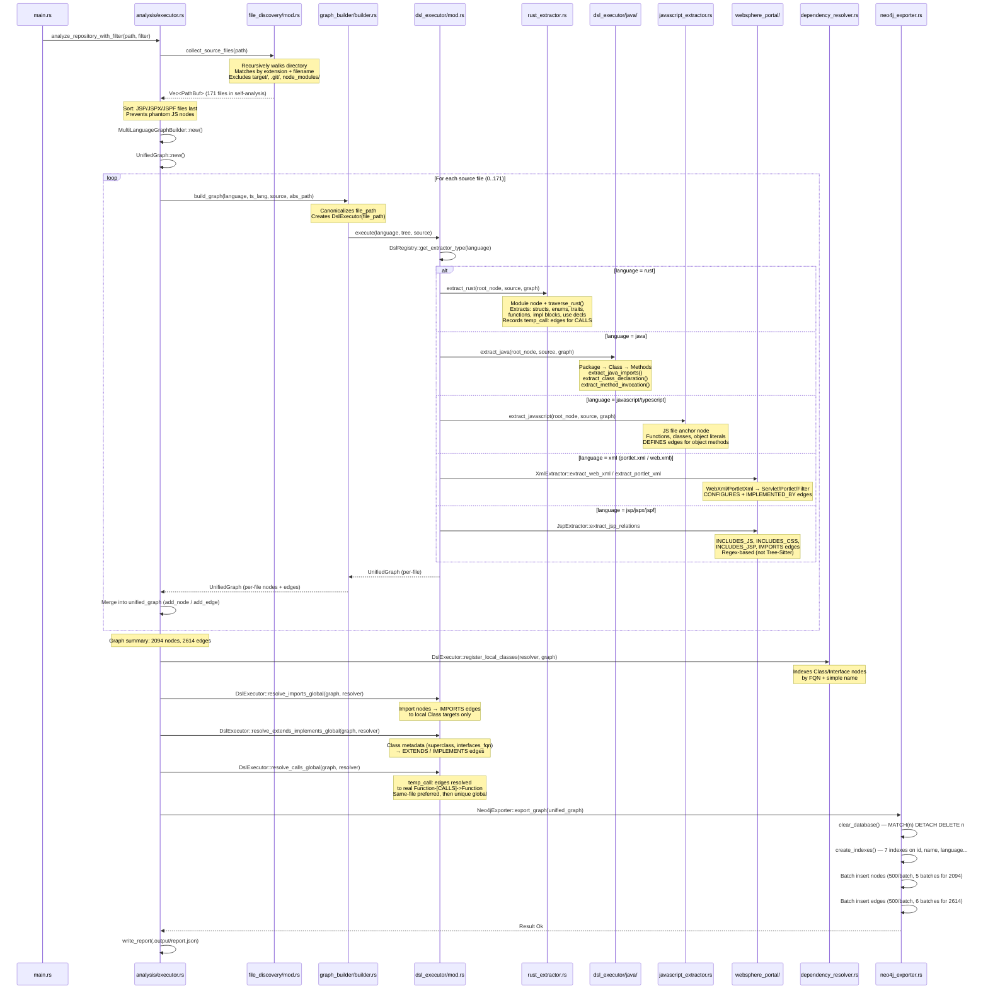
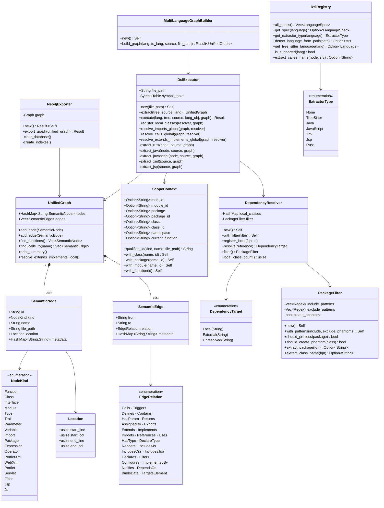
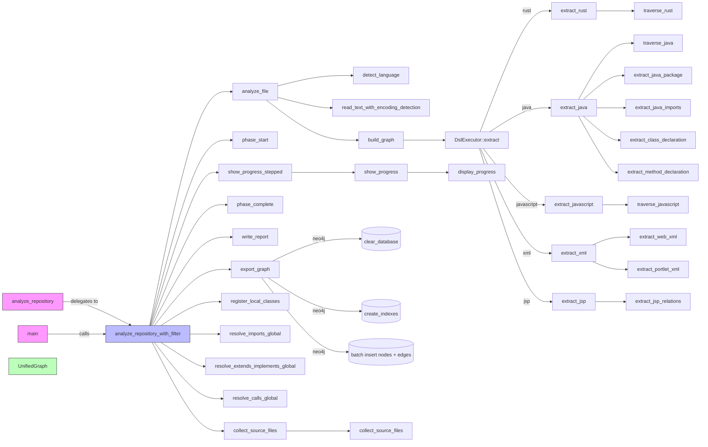
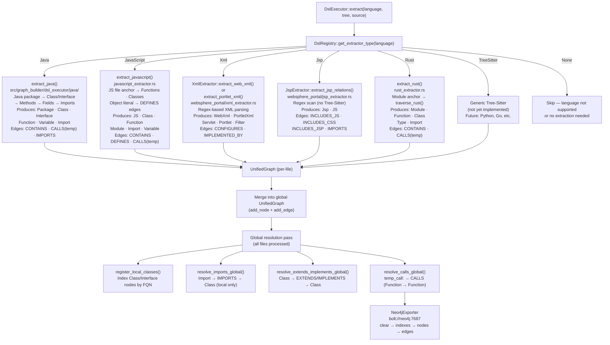

# RETRODOC — code-continuum

> Generated by the retrodoc agent via live Neo4j queries.
> Date: 2026-03-01
> Analyzed source: /workspaces/code-continuum (Rust + Java + JavaScript + JSP + XML)
> Graph: 2,094 nodes, 2,614 edges exported from 171 source files

---

## 1. Project Overview

**code-continuum** is a multi-language static analysis tool written in Rust. It parses source code across five language families — Rust, Java, JavaScript/TypeScript, JSP/JSPX/JSPF, and WebSphere Portal XML — using [Tree-Sitter](https://tree-sitter.github.io/) as the AST backend and exports a unified semantic graph to Neo4j. The graph is then queryable via Cypher for code intelligence, migration analysis, and dependency tracing.

The project exposes two operating modes. In CLI mode (`cargo run -- <directory>`), it scans a repository, builds a multi-language semantic graph, resolves cross-file dependencies (imports, inheritance, call graphs), and bulk-exports to Neo4j in batches of 500 nodes. In MCP mode (`--mcp`), it exposes a stdio JSON-RPC server (Model Context Protocol) that allows AI agents to trigger analysis and execute Cypher queries against the running Neo4j instance.

The architecture is layered around three concerns: **extraction** (Tree-Sitter AST → SemanticNode/SemanticEdge per file), **resolution** (global cross-file merging of `CALLS`, `IMPORTS`, `EXTENDS`/`IMPLEMENTS` relationships), and **export** (Neo4j batch write via the neo4rs driver). The `DslRegistry` struct acts as the language router, mapping file extensions to Tree-Sitter parsers and specialized extractors. The `UnifiedGraph` struct is the central in-memory accumulator that absorbs per-file graphs before global resolution and export.

---

## 2. Module/File Hierarchy

```mermaid
graph TD
    subgraph "src/ (root)"
        main["main.rs"]
        lib["lib.rs"]
        main --> main_fn(main)
    end

    subgraph "src/analysis/"
        exec["executor.rs"]
        amod["mod.rs"]
        exec --> analyze_repository(analyze_repository)
        exec --> analyze_repository_with_filter(analyze_repository_with_filter)
        exec --> analyze_file(analyze_file)
        exec --> detect_language(detect_language)
        amod --> AnalysisReport[AnalysisReport]
        amod --> FileError[FileError]
        amod --> ParseError[ParseError]
    end

    subgraph "src/semantic_graph/"
        sg["semantic_graph.rs"]
        dsl_mod["dsl.rs"]
        neo_exp["neo4j_exporter.rs"]
        sg --> SemanticNode[SemanticNode]
        sg --> SemanticEdge[SemanticEdge]
        sg --> UnifiedGraph[UnifiedGraph]
        sg --> NodeKind{NodeKind}
        sg --> EdgeRelation{EdgeRelation}
        sg --> Location[Location]
        dsl_mod --> DslRegistry[DslRegistry]
        dsl_mod --> LanguageSpec[LanguageSpec]
        dsl_mod --> ExtractorType{ExtractorType}
        neo_exp --> Neo4jExporter[Neo4jExporter]
        neo_exp --> export_graph(export_graph)
        neo_exp --> clear_database(clear_database)
        neo_exp --> create_indexes(create_indexes)
    end

    subgraph "src/graph_builder/"
        builder["builder.rs"]
        gbmod["mod.rs"]
        builder --> MultiLanguageGraphBuilder[MultiLanguageGraphBuilder]
        builder --> build_graph(build_graph)
    end

    subgraph "src/graph_builder/dsl_executor/"
        dslmod["mod.rs"]
        rust_ext["rust_extractor.rs"]
        js_ext["javascript_extractor.rs"]
        dep_res["dependency_resolver.rs"]
        dslmod --> DslExecutor[DslExecutor]
        dslmod --> ScopeContext[ScopeContext]
        dslmod --> SymbolTable[SymbolTable]
        dslmod --> extract(extract)
        dslmod --> execute(execute)
        dslmod --> resolve_calls_global(resolve_calls_global)
        dslmod --> resolve_imports_global(resolve_imports_global)
        dslmod --> resolve_extends_implements_global(resolve_extends_implements_global)
        dslmod --> register_local_classes(register_local_classes)
        rust_ext --> extract_rust(extract_rust)
        rust_ext --> traverse_rust(traverse_rust)
        js_ext --> extract_javascript(extract_javascript)
        dep_res --> DependencyResolver[DependencyResolver]
        dep_res --> DependencyTarget{DependencyTarget}
    end

    subgraph "src/graph_builder/dsl_executor/java/"
        java_mod["mod.rs"]
        class_ext["class_extractor.rs"]
        method_ext["method_extractor.rs"]
        import_ext["import_extractor.rs"]
        field_ext["field_extractor.rs"]
        pkg_ext["package_extractor.rs"]
        sym_tbl["symbol_table.rs"]
        java_mod --> extract_java(extract_java)
        java_mod --> traverse_java(traverse_java)
        class_ext --> extract_class_declaration(extract_class_declaration)
        class_ext --> extract_interface_declaration(extract_interface_declaration)
        method_ext --> extract_method_declaration(extract_method_declaration)
        method_ext --> extract_method_invocation(extract_method_invocation)
        import_ext --> extract_java_imports(extract_java_imports)
        pkg_ext --> extract_java_package(extract_java_package)
    end

    subgraph "src/graph_builder/dsl_executor/websphere_portal/"
        jsp_ext["jsp_extractor.rs"]
        xml_ext["xml_extractor.rs"]
        portlet_ext["portlet_extractor.rs"]
        rels["relations.rs"]
        jsp_ext --> JspExtractor[JspExtractor]
        jsp_ext --> extract_jsp_relations(extract_jsp_relations)
        xml_ext --> XmlExtractor[XmlExtractor]
        xml_ext --> extract_web_xml(extract_web_xml)
        xml_ext --> extract_portlet_xml(extract_portlet_xml)
        portlet_ext --> PortletExtractor[PortletExtractor]
        rels --> WebSphereRelation{WebSphereRelation}
        rels --> DaoOperation{DaoOperation}
        rels --> RelationPriority{RelationPriority}
    end

    subgraph "src/config/"
        cfg["package_filter.rs"]
        cfg --> PackageFilter[PackageFilter]
        cfg --> should_process(should_process)
        cfg --> should_create_phantom(should_create_phantom)
    end

    subgraph "src/file_discovery/"
        fdisc["mod.rs"]
        fdisc --> collect_source_files(collect_source_files)
    end

    subgraph "src/neo4j_connectivity/"
        neo_con["mod.rs"]
        neo_con --> test_connection(test_connection)
    end

    subgraph "src/encoding/ · src/reporting/ · src/ui/ · src/cli/"
        enc["encoding/mod.rs"]
        rep["reporting/mod.rs"]
        ui_mod["ui/mod.rs"]
        cli_mod["cli/mod.rs"]
        enc --> read_text_with_encoding_detection(read_text_with_encoding_detection)
        rep --> write_report(write_report)
        ui_mod --> show_progress_stepped(show_progress_stepped)
        ui_mod --> phase_start(phase_start)
        ui_mod --> phase_complete(phase_complete)
        cli_mod --> CliArgs[CliArgs]
        cli_mod --> parse_args(parse_args)
    end
```



### Module Inventory

| Module (file) | Functions | Structs/Classes | Enums/Types | Imports |
|---|---|---|---|---|
| `src/main.rs` | `main` | — | — | 5 |
| `src/lib.rs` | — | — | — | — |
| `src/analysis/executor.rs` | `analyze_repository`, `analyze_repository_with_filter`, `analyze_file`, `detect_language` | — | — | 8 |
| `src/analysis/mod.rs` | — | `AnalysisReport`, `FileError`, `ParseError` | — | 1 |
| `src/cli/mod.rs` | `parse_args`, `validate_path` | `CliArgs` | — | 1 |
| `src/config/package_filter.rs` | `new`, `with_patterns`, `should_process`, `should_create_phantom`, `extract_package`, `extract_class_name`, + 6 tests | `PackageFilter` | — | 2 |
| `src/encoding/mod.rs` | `read_text_with_encoding_detection` | — | — | 2 |
| `src/file_discovery/mod.rs` | `collect_source_files` | — | — | 2 |
| `src/graph_builder/builder.rs` | `new`, `build_graph`, `default`, + 2 tests | `MultiLanguageGraphBuilder` | — | 5 |
| `src/graph_builder/dsl_executor/mod.rs` | `new`, `extract`, `execute`, `register_local_classes`, `resolve_imports_global`, `resolve_calls_global`, `resolve_extends_implements_global`, `resolve_class_reference`, `extract_xml`, `extract_jsp`, + helpers | `DslExecutor`, `ScopeContext`, `SymbolTable` | — | 9 |
| `src/graph_builder/dsl_executor/dependency_resolver.rs` | `new`, `with_filter`, `register_local`, `resolve`, `filter`, `local_class_count`, + 7 tests | `DependencyResolver` | `DependencyTarget` | 3 |
| `src/graph_builder/dsl_executor/rust_extractor.rs` | `extract_rust`, `collect_local_type_names`, `traverse_rust` | — | — | 5 |
| `src/graph_builder/dsl_executor/javascript_extractor.rs` | `extract_javascript`, `traverse_javascript`, `build_javascript_symbol_table`, `collect_javascript_fields` | — | — | 5 |
| `src/graph_builder/dsl_executor/java/mod.rs` | `extract_java`, `traverse_java`, `looks_like_class_identifier` | — | — | 3 |
| `src/graph_builder/dsl_executor/java/class_extractor.rs` | `extract_class_declaration`, `extract_interface_declaration`, `extract_class_inheritance_metadata`, `link_class_to_parent`, `resolve_via_imports` | — | — | 5 |
| `src/graph_builder/dsl_executor/java/method_extractor.rs` | `extract_method_declaration`, `extract_method_invocation`, `resolve_method_invocation_object` | — | — | 5 |
| `src/graph_builder/dsl_executor/java/import_extractor.rs` | `extract_java_imports`, `create_import_relations_java`, `create_class_import_relations` | — | — | 4 |
| `src/graph_builder/dsl_executor/java/field_extractor.rs` | `extract_field_declaration`, `extract_formal_parameter`, `extract_local_variable_declaration` | — | — | 4 |
| `src/graph_builder/dsl_executor/java/package_extractor.rs` | `extract_java_package`, `create_module_node` | — | — | 5 |
| `src/graph_builder/dsl_executor/java/symbol_table.rs` | `build_java_symbol_table` | — | — | 3 |
| `src/graph_builder/dsl_executor/websphere_portal/jsp_extractor.rs` | `new`, `extract_jsp_relations`, `create_includes_js_relation`, `create_includes_css_relation`, `create_includes_jsp_relation`, `create_imports_relation`, + 7 tests | `JspExtractor` | — | 6 |
| `src/graph_builder/dsl_executor/websphere_portal/xml_extractor.rs` | `new`, `extract_web_xml`, `extract_portlet_xml`, `create_servlet_declaration`, `create_filter_declaration`, `create_portlet_configuration`, + 2 tests | `XmlExtractor` | — | 5 |
| `src/graph_builder/dsl_executor/websphere_portal/portlet_extractor.rs` | `new`, `extract_portlet_relations`, `find_portlet_class`, `extract_dispatch_calls`, `infer_mode_from_method`, `create_renders_relation`, + helpers | `PortletExtractor` | — | 4 |
| `src/graph_builder/dsl_executor/websphere_portal/relations.rs` | `as_str`, `priority`, `from_method_name`, + 3 tests | `CallsAjaxMetadata`, `CallsDaoMetadata`, `CallsServiceMetadata`, `ConfiguresMetadata`, `RendersMetadata` | `WebSphereRelation`, `DaoOperation`, `RelationPriority` | 3 |
| `src/semantic_graph/semantic_graph.rs` | `new`, `add_node`, `add_edge`, `find_functions`, `find_calls_to`, `print_summary`, `resolve_extends_implements_local`, `default` | `SemanticNode`, `SemanticEdge`, `UnifiedGraph`, `Location` | `NodeKind`, `EdgeRelation` | 2 |
| `src/semantic_graph/dsl.rs` | `all_specs`, `get_spec`, `get_dsl`, `supported_languages`, `get_tree_sitter_language`, `detect_language_from_extension`, `detect_language_from_path`, `is_supported`, `has_specialized_extractor`, `get_extractor_type`, `extract_callee_name`, `identifier_text` | `DslRegistry`, `LanguageSpec` | `ExtractorType` | 2 |
| `src/semantic_graph/neo4j_exporter.rs` | `new`, `export_graph`, `create_indexes`, `clear_database`, `test_connection` | `Neo4jExporter` | — | 4 |
| `src/neo4j_connectivity/mod.rs` | `test_connection` | — | — | 2 |
| `src/reporting/mod.rs` | `write_report` | — | — | 1 |
| `src/ui/mod.rs` | `display_progress`, `show_progress`, `show_progress_stepped`, `show_batch_progress`, `phase_start`, `phase_complete`, + 3 tests | — | — | 3 |
| `src/graph_builder/dsl_graph/mod.rs` | `supported_languages` | — | — | 1 |

---

## 3. Analysis Pipeline



### Pipeline Steps

1. **File discovery** (`collect_source_files`) — Recursively walks the target directory. Files are matched by extension (`.rs`, `.java`, `.js`, `.ts`, `.jsx`, `.tsx`, `.jsp`, `.jspx`, `.jspf`, `portlet.xml`, `web.xml`). Excludes `target/`, `.git/`, `node_modules/`. JSP/JSPX/JSPF files are sorted last to prevent phantom JS node creation.

2. **Language detection** (`DslRegistry::detect_language_from_path`) — Checks file extension first, then filename patterns (e.g. `portlet.xml`). Returns a `&'static str` language identifier.

3. **File reading** (`read_text_with_encoding_detection`) — Auto-detects encoding (UTF-8, UTF-16, Latin-1) using byte-order marks and heuristics. Returns `String`.

4. **AST parsing** (Tree-Sitter) — `MultiLanguageGraphBuilder::build_graph()` calls `DslRegistry::get_tree_sitter_language()` to obtain the Tree-Sitter parser, then parses the source into a `tree_sitter::Tree`.

5. **Semantic extraction** (`DslExecutor::extract`) — Dispatches to the appropriate extractor based on `ExtractorType`. Each extractor traverses the AST recursively and produces a per-file `UnifiedGraph` with `SemanticNode` and `SemanticEdge` objects. Call edges are recorded as `temp_call:` placeholders at this stage.

6. **Global resolution** — Three passes over the merged `UnifiedGraph`:
   - `resolve_imports_global`: Creates `IMPORTS` edges from Import nodes to local Class targets.
   - `resolve_extends_implements_global`: Creates `EXTENDS`/`IMPLEMENTS` edges using class metadata (FQN first, simple name fallback).
   - `resolve_calls_global`: Resolves all `temp_call:` placeholder edges into real `CALLS` edges between Function nodes (same-file-first strategy; falls back to unique global candidate).

7. **Neo4j export** (`Neo4jExporter::export_graph`) — Clears the database, creates 7 indexes, then batch-inserts nodes (500/batch) and edges (500/batch) using the neo4rs Bolt driver. Labels are applied dynamically based on `NodeKind` (e.g. `Function`, `Class`, `Module`). The `NEO4J_LABEL_MODE` env var controls whether typed labels, property-only, or both are used (default: both).

---

## 4. Core Data Structures



### Key Types

| Type | Kind | File | Role |
|------|------|------|------|
| `SemanticNode` | Struct | `src/semantic_graph/semantic_graph.rs:9` | Core graph node (id, kind, name, file_path, location, metadata) |
| `SemanticEdge` | Struct | `src/semantic_graph/semantic_graph.rs:76` | Directed graph edge (from, to, relation, metadata) |
| `UnifiedGraph` | Struct | `src/semantic_graph/semantic_graph.rs:158` | Central in-memory graph accumulator |
| `NodeKind` | Enum | `src/semantic_graph/semantic_graph.rs:21` | 19 variants for all entity types across all languages |
| `EdgeRelation` | Enum | `src/semantic_graph/semantic_graph.rs:86` | 24 variants for all relationship types |
| `Location` | Struct | `src/semantic_graph/semantic_graph.rs:66` | Source position (start_line, start_col, end_line, end_col) |
| `DslExecutor` | Struct | `src/graph_builder/dsl_executor/mod.rs:127` | Per-file extraction engine + global resolution methods |
| `ScopeContext` | Struct | `src/graph_builder/dsl_executor/mod.rs:52` | Hierarchical scope tracker for qualified ID generation |
| `SymbolTable` | Struct | `src/graph_builder/dsl_executor/mod.rs:27` | Variable-to-type mapping for call resolution |
| `DependencyResolver` | Struct | `src/graph_builder/dsl_executor/dependency_resolver.rs:21` | Cross-file class/interface registry for global resolution |
| `DependencyTarget` | Enum | `src/graph_builder/dsl_executor/dependency_resolver.rs:8` | `Local(id)` / `External(fqn)` / `Unresolved(name)` |
| `MultiLanguageGraphBuilder` | Struct | `src/graph_builder/builder.rs:9` | Orchestrates Tree-Sitter parsing + DslExecutor per file |
| `Neo4jExporter` | Struct | `src/semantic_graph/neo4j_exporter.rs:8` | Batch Neo4j writer (500 nodes/batch, neo4rs Bolt driver) |
| `DslRegistry` | Struct | `src/semantic_graph/dsl.rs:229` | Language router: extension → parser → ExtractorType |
| `LanguageSpec` | Struct | `src/semantic_graph/dsl.rs:95` | Per-language specification (name, extensions, ts parser, extractor) |
| `ExtractorType` | Enum | `src/semantic_graph/dsl.rs:52` | 7 variants: None, TreeSitter, Java, JavaScript, Xml, Jsp, Rust |
| `PackageFilter` | Struct | `src/config/package_filter.rs:7` | Include/exclude filter on Java packages using regex patterns |
| `AnalysisReport` | Struct | `src/analysis/mod.rs:19` | JSON report: file counts, parse errors, supported languages |
| `CliArgs` | Struct | `src/cli/mod.rs:3` | Parsed CLI arguments (source_directory) |
| `JspExtractor` | Struct | `src/graph_builder/dsl_executor/websphere_portal/jsp_extractor.rs:15` | Regex-based JSP analyzer for INCLUDES_* and IMPORTS relations |
| `XmlExtractor` | Struct | `src/graph_builder/dsl_executor/websphere_portal/xml_extractor.rs:15` | Regex-based web.xml/portlet.xml analyzer |
| `PortletExtractor` | Struct | `src/graph_builder/dsl_executor/websphere_portal/portlet_extractor.rs:20` | Extracts portlet RENDERS relations from Java source |
| `WebSphereRelation` | Enum | `src/graph_builder/dsl_executor/websphere_portal/relations.rs:14` | WebSphere-specific relation types with priority and metadata |
| `DaoOperation` | Enum | `src/graph_builder/dsl_executor/websphere_portal/relations.rs:169` | DAO operation categories: Select, Insert, Update, Delete, Other |
| `RelationPriority` | Enum | `src/graph_builder/dsl_executor/websphere_portal/relations.rs:98` | Priority ordering for call type classification |

---

## 5. Call Graph



### Entry Points

| Function | File | Description |
|----------|------|-------------|
| `main` | `src/main.rs:20` | Binary entry: parses CLI args, checks Neo4j connectivity, applies INCLUDE_PACKAGES env var filter, calls `analyze_repository_with_filter` |
| `analyze_repository` | `src/analysis/executor.rs:99` | Thin public API wrapper: calls `analyze_repository_with_filter(path, None)` |
| `analyze_repository_with_filter` | `src/analysis/executor.rs:104` | Full pipeline orchestrator: file discovery → per-file extraction → global resolution → Neo4j export |

---

## 6. Language Dispatch



### Supported Extractors

| Language | Extensions / Filenames | Extractor File | Produced Nodes | Key Edges |
|----------|----------------------|----------------|----------------|-----------|
| `rust` | `.rs` | `rust_extractor.rs` | `Module` · `Function` · `Class` (struct) · `Type` (enum) · `Import` | `CONTAINS` · `CALLS` |
| `java` | `.java` | `dsl_executor/java/` (6 files) | `Package` · `Class` · `Interface` · `Function` · `Variable` · `Import` | `CONTAINS` · `CALLS` · `IMPORTS` · `EXTENDS` · `IMPLEMENTS` |
| `javascript` | `.js` `.ts` `.jsx` `.tsx` | `javascript_extractor.rs` | `JS` · `Class` · `Function` · `Module` · `Import` · `Variable` | `CONTAINS` · `DEFINES` · `CALLS` |
| `xml` | `portlet.xml` · `web.xml` | `websphere_portal/xml_extractor.rs` | `WebXml` · `PortletXml` · `Servlet` · `Portlet` · `Filter` | `CONFIGURES` · `IMPLEMENTED_BY` |
| `jsp` | `.jsp` `.jspx` `.jspf` | `websphere_portal/jsp_extractor.rs` | `Jsp` · `JS` | `INCLUDES_JS` · `INCLUDES_CSS` · `INCLUDES_JSP` · `IMPORTS` |

> Note: Rust Traits (`NodeKind::Trait`) are defined in the enum but were not produced in the self-analysis run (the current Rust extractor maps `trait` items to `Class` nodes). No Trait nodes appeared in the live graph (Q6: 0 Trait nodes for `language='rust'`).

---

## 7. MCP Server

The MCP (Model Context Protocol) server is activated via the `--mcp` command-line flag. When present, `main.rs` switches logging to stderr-only (to avoid contaminating the stdio JSON-RPC channel) and enters MCP mode. The MCP implementation is external to the `src/` tree and is configured via the `.mcp.json` or `mcp_config.json` file in the project root, which registers this binary as a tool provider.

### Available Tools (as documented in `.claude/agents/retrodoc.md` and project README)

| Tool | Parameters | Description |
|------|-----------|-------------|
| `parse_project` | `path` (required), `languages` (optional) | Analyzes a directory and exports the semantic graph to Neo4j. Internally calls `analyze_repository_with_filter`. |
| `execute_cypher` | `query` (required), `limit` (default 100) | Runs a read Cypher query against the connected Neo4j instance and returns results as JSON. |

### Available Prompts

| Prompt | Description |
|--------|-------------|
| `parse_project_guide` | Step-by-step guide for using the `parse_project` tool, including package filter configuration |
| `code_continuum_schema` | Full Neo4j schema reference (node labels, relation types, Cypher query patterns) — mirrors `doc/SCHEMA_IA.md` |

---

## 8. Graph Statistics (live data — self-analysis run 2026-03-01)

### Node counts by language and type

| Language | Node Type | Count |
|----------|-----------|-------|
| `java` | Function | 374 |
| `java` | Variable | 232 |
| `java` | Parameter | 167 |
| `java` | Class | 125 |
| `java` | Import | 87 |
| `java` | Package | 51 |
| `java` | Module | 51 |
| `java` | Interface | 1 |
| `rust` | Function | 319 |
| `rust` | Module | 234 |
| `rust` | Import | 217 |
| `rust` | Class | 25 |
| `rust` | Type | 10 |
| `javascript` | Function | 119 |
| `javascript` | JS | 17 |
| `javascript` | Class | 16 |
| `javascript` | Module | 8 |
| `unknown` | Jsp | 18 |
| `unknown` | Portlet | 7 |
| `unknown` | Module | 5 |
| `unknown` | Servlet | 4 |
| `unknown` | JS | 3 |
| `unknown` | Filter | 2 |
| `unknown` | PortletXml | 1 |
| `unknown` | WebXml | 1 |
| **Total** | | **2,094** |

### Edge counts by relationship type

| Relationship | Count |
|-------------|-------|
| `CONTAINS` | 1,282 |
| `CALLS` | 741 |
| `DEFINES` | 377 |
| `IMPORTS` | 97 |
| `EXTENDS` | 10 |
| `IMPLEMENTS` | 1 |
| **Total** | **2,614** |

### Rust-specific breakdown

| Node Type | Count | Notes |
|-----------|-------|-------|
| Function | 319 | Includes methods, standalone functions, test functions |
| Module | 234 | One per `.rs` file + sub-modules; inflated by `target/` build artifacts |
| Import | 217 | One per `use` declaration |
| Class | 25 | Structs only (Rust `struct` items, `metadata.kind='struct'`) |
| Type | 10 | Enums (`metadata.kind='enum'`) |

> Note: The self-analysis scanned 171 files including `target/debug/build/` generated files (chrono-tz timezone databases, serde generated code). The `src/` directory alone contains 30 `.rs` files producing the core 319 Rust functions and 25 Rust structs.

---

## 9. Key Cypher Queries for This Project

```cypher
// 1. Inspect the full src/ module hierarchy (excluding target/ build artifacts)
MATCH (m:Module)-[:CONTAINS]->(child)
WHERE m.language = 'rust' AND m.file_path CONTAINS '/src/'
RETURN m.file_path AS module,
       labels(child) AS kind,
       child.name AS name
ORDER BY module, name

// 2. Trace the full analysis pipeline from main entry point
MATCH path = (start:Function {name: 'analyze_repository_with_filter'})-[:CALLS*1..4]->(end:Function)
WHERE start.language = 'rust'
RETURN [n IN nodes(path) | n.name] AS call_chain,
       length(path) AS depth
ORDER BY depth

// 3. Find all structs and their methods in the Rust source
MATCH (c:Class)-[:CONTAINS]->(f:Function)
WHERE c.language = 'rust' AND c.file_path CONTAINS '/src/'
RETURN c.name AS struct_name, collect(f.name) AS methods
ORDER BY struct_name

// 4. List all enums (Type nodes) with their source files
MATCH (t:Type)
WHERE t.language = 'rust' AND t.file_path CONTAINS '/src/'
RETURN t.name AS enum_name, t.file_path AS file, t.start_line AS line
ORDER BY file, line

// 5. Inspect all extractor functions and their locations
MATCH (f:Function)
WHERE f.language = 'rust'
  AND (f.name STARTS WITH 'extract_' OR f.name = 'traverse_rust' OR f.name = 'traverse_java')
  AND f.file_path CONTAINS '/src/'
RETURN f.name AS extractor, f.file_path AS file, f.start_line AS line
ORDER BY file, line

// 6. Find all Java classes that extend or implement something
MATCH (c:Class)-[:EXTENDS|IMPLEMENTS]->(parent)
WHERE c.language = 'java'
RETURN c.name AS child, type(last(relationships(MATCH (c)-[r]->(parent) RETURN r))) AS relation, parent.name AS parent_name
LIMIT 50

// 7. Find all Rust import paths grouped by source file (src/ only)
MATCH (i:Import)
WHERE i.language = 'rust' AND i.file_path CONTAINS '/src/'
RETURN i.file_path AS file,
       collect(i.name) AS imports
ORDER BY file

// 8. Count functions per file for hotspot analysis
MATCH (m:Module)-[:CONTAINS]->(f:Function)
WHERE m.language = 'rust' AND m.file_path CONTAINS '/src/'
RETURN m.file_path AS file, count(f) AS function_count
ORDER BY function_count DESC

// 9. Explore WebSphere portal configuration: Portlet -> Class -> Method -> JSP
MATCH (p:Portlet)-[:IMPLEMENTED_BY]->(c:Class)
OPTIONAL MATCH (c)-[:CONTAINS]->(m:Function)
RETURN p.name AS portlet, c.name AS class, collect(m.name) AS methods
ORDER BY portlet

// 10. Find all JSP files and their JavaScript/CSS/JSP inclusions
MATCH (jsp:Jsp)-[r:INCLUDES_JS|INCLUDES_CSS|INCLUDES_JSP]->(target)
RETURN jsp.file_path AS jsp_file, type(r) AS relation, target.file_path AS included
ORDER BY jsp_file
```

---

*This document was generated by the retrodoc agent (claude-sonnet-4-6) on 2026-03-01 via live analysis of the code-continuum repository. The semantic graph was built by running `cargo run -- .` against the project root, producing 2,094 nodes and 2,614 edges. All diagrams and tables are derived from actual Neo4j query results.*
