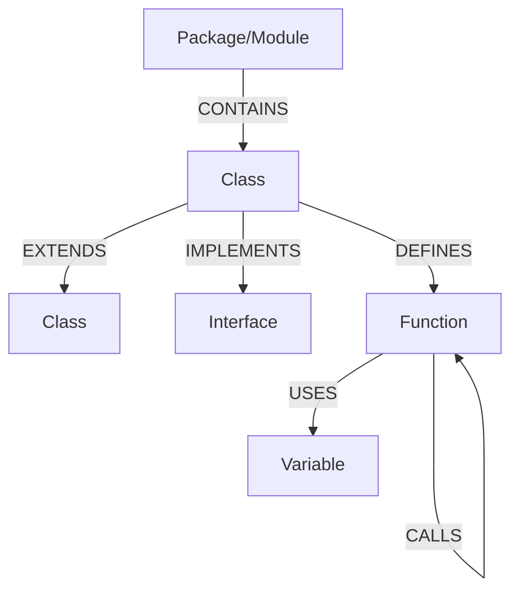
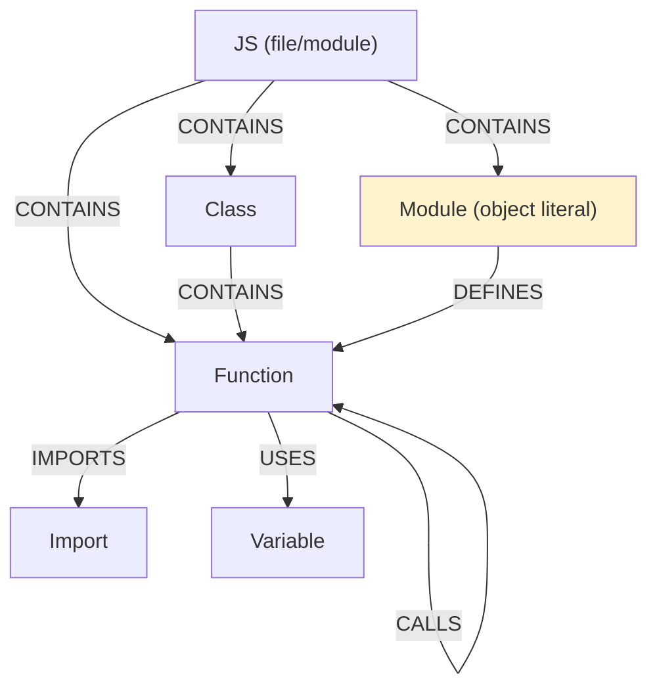
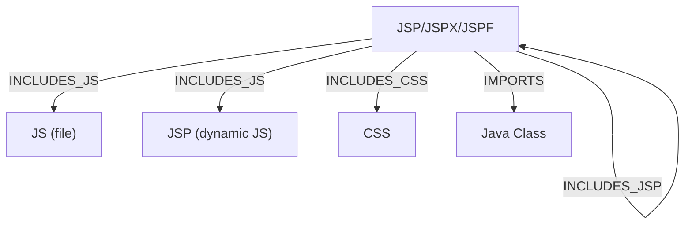
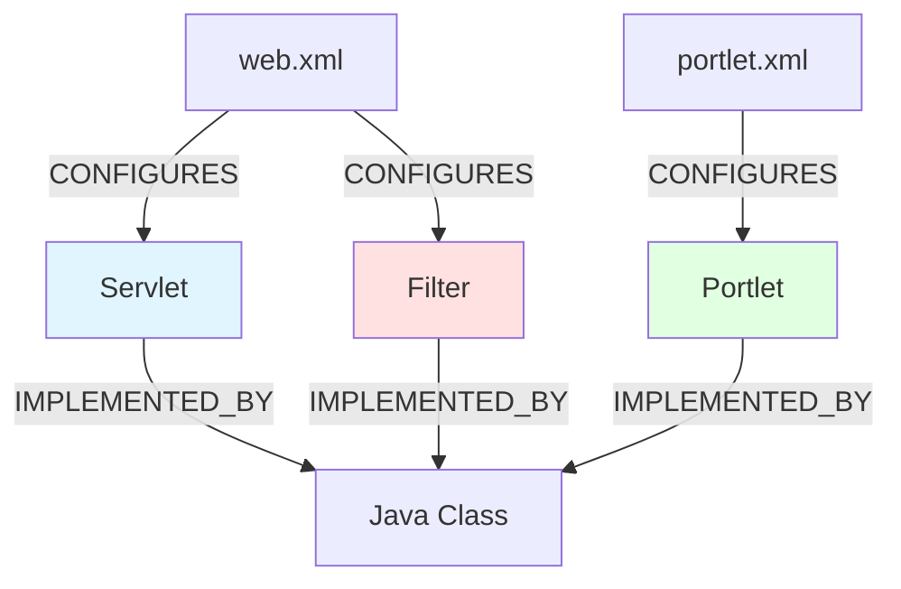

# Neo4j Schema - code-continuum

Complete data model documentation. **Based on the actual code in `neo4j_exporter.rs`.**

---

## Global Schema

### Java Ecosystem



### JavaScript Ecosystem



### JSP Ecosystem



> ⚠️ `INCLUDES_JS` can point to a `.js` file **or** a `.jsp`/`.jspx` that generates dynamic JavaScript.

### WebSphere Ecosystem



> `url-pattern` is stored in node metadata for Servlet and Filter nodes.

---

## Node Labels

All nodes carry the `:Node` label plus a specific label.

### Common Properties (all nodes)

```
{
  id:             String    # Unique qualified identifier (e.g. "com.app.UserService.getUser")
  name:           String    # Short name (e.g. "getUser", "UserService")
  node_type:      String    # Type (see table below)
  language:       String    # Source language ("java", "javascript", "jsp", "xml")
  file_path:      String    # Source file path
  module:         String    # Module/Package (optional)
  package:        String    # Package (Java)
  class:          String    # Containing class (for methods)
  caller_id:      String    # Call context ID (optional)
  object_type:    String    # Object type (optional)
  start_line:     Integer   # Start line in file
  start_col:      Integer   # Start column
  end_line:       Integer   # End line
  end_col:        Integer   # End column
}
```

### Label Table

| Label | Description | Example |
|-------|-------------|---------|
| `:Function` | Function/Method | `getUser()`, `calculateTotal()` |
| | _Metadata `object_method: true`_ if JS object literal method | `obj.method = function(){}` |
| `:Class` | Class/Type | `UserService`, `User` |
| `:Interface` | Interface | `IUserRepository` |
| `:Module` | Module/Namespace or **Object Literal** (JS) | `controllers`, `compasNotification` |
| | _Metadata `object_literal: true`_ if JS object literal | `var obj = { method: function(){} }` |
| `:Package` | Java package | `com.app.services` |
| `:Import` | Import/require | `import { Component }` |
| `:Variable` | Local variable | `count`, `userData` |
| `:Parameter` | Function parameter | `userId`, `request` |
| `:Type` | Custom type | `Result<T>`, `Promise<Data>` |
| `:Trait` | Trait/Mixin | `Serializable` (Rust) |
| `:Expression` | Expression | Assignments, operations |
| `:Operator` | Operator | `+`, `-`, `==` |
| `:JS` | JavaScript file/module (anchor for classes and functions) | `web/app.js` |
| `:PortletXml` | `portlet.xml` file | Portlet configuration |
| `:WebXml` | `web.xml` file | Web configuration |
| `:Portlet` | Declared portlet | In `portlet.xml` |
| `:Servlet` | Declared servlet | In `web.xml` |
| `:Filter` | Declared filter | In `web.xml` |
| `:Jsp` | JSP file | `index.jsp`, `header.jspf`, `footer.jspx` |

---

## Relations

### Main Relation Matrix

| Relation | From → To | Meaning | Example |
|----------|-----------|---------|---------|
| **CALLS** | Function → Function | Direct call | `UserService.delete()` → `Database.remove()` |
| | | _Metadata: call_type="ajax", method="POST"_ | JS → Servlet via AJAX |
| | | _Metadata: call_type="service"_ | Portlet → Service |
| | | _Metadata: call_type="dao", operation="QUERY"_ | Service → DAO |
| **DEFINES** | Class → Function | Class defines a method | `UserService` → `getUser()` |
| | Module (object literal) → Function | Object literal defines its methods | `compasNotification` → `chargeActeur()` |
| **CONTAINS** | JS/Module → Class/Function | A JS file or module contains classes and/or top-level functions | `web/app.js` → `init` |
| **IMPORTS** | Function/Class → Import | Import/require used | `Controller` → `@Component` |
| **EXTENDS** | Class → Class | Inheritance | `AdminService` → `UserService` |
| **IMPLEMENTS** | Class → Interface | Implementation | `UserServiceImpl` → `IUserService` |
| **IMPLEMENTED_BY** | Interface → Class | Inverse of IMPLEMENTS | `IUserService` → `UserServiceImpl` |
| | Portlet/Servlet/Filter → Class | WebSphere component implementation | `UserPortlet` → `com.app.UserPortletImpl` |
| **USES** | Function → Variable | Function uses a variable | `getUser()` → `userData` |
| **HAS_PARAM** | Function → Parameter | Function has a parameter | `getUser()` → `userId` |
| **RETURNS** | Function → Type | Function return type | `getUser()` → `User` |
| **ASSIGNED_BY** | Variable → Expression | Variable assigned by expression | `count` ← `x + 1` |
| **TRIGGERS** | Function → Node | Function triggers a node | `onClick()` → `submitForm()` |
| **REFERENCES** | Node → Definition | References a definition | `userRef` → `User` |
| **HAS_TYPE** | Node → Type | Node has a type | `userData` → `UserData` |
| **DECLARE_TYPE** | Node → Type | Node declares a type | `User` → type definition |
| **EXPORTS** | Module → Symbol | Exposes a symbol | `module` → `getUser` |
| **CONFIGURES** | PortletXml/WebXml → Portlet/Servlet/Filter | XML configures component | `portlet.xml` → `UserPortlet` |
| **DECLARES** | WebXml → Servlet | web.xml declares a servlet | `web.xml` → `UserServlet` |
| **FILTERS** | Filter → Servlet | Filter applies to servlet | `AuthFilter` → `UserServlet` |
| **RENDERS** | Portlet → JSP | Portlet renders a JSP | `UserPortlet` → `user.jsp` |
| **INCLUDES_JS** | JSP → JS or JSP | JSP includes JavaScript (.js) or a dynamic JSP generating JS | `index.jsp` → `app.js` |
| **INCLUDES_CSS** | JSP → CSS | JSP includes CSS | `index.jsp` → `style.css` |
| **INCLUDES_JSP** | JSP → JSP | JSP inclusion | `layout.jsp` → `header.jspf` |
| **NOTIFIES** | Service → Service | Service sends notification | `OrderService` → `EmailService` |
| **DEPENDS_ON** | JS → JS | JavaScript depends on another | `app.js` → `utils.js` |
| **BINDS_DATA** | JSP ↔ JS | JSP and JS share data | `form.jsp` ↔ `validator.js` |
| **TARGETS_ELEMENT** | JS → DOM | JavaScript targets a DOM element | `app.js` → `#submitBtn` |

---

## JAVA

### Typical structure

```
Package: com.app.services
  ├─ Class: UserService
  │   ├─ Function: getUser(userId: int)
  │   │   └─ CALLS → UserRepository.findById()
  │   ├─ Function: deleteUser(userId: int)
  │   │   └─ CALLS → Database.delete()
  │   └─ USES → logger: Logger
  └─ Class: UserRepository implements IUserRepository
      └─ Function: findById(id: int)
         └─ USES → Connection
```

### Example Java nodes

**Class**
```json
{
  "id": "com.app.services.UserService",
  "name": "UserService",
  "node_type": "Class",
  "language": "java",
  "file_path": "src/main/java/com/app/services/UserService.java",
  "package": "com.app.services",
  "start_line": 10,
  "end_line": 120
}
```

**Method**
```json
{
  "id": "com.app.services.UserService.getUser",
  "name": "getUser",
  "node_type": "Function",
  "language": "java",
  "file_path": "src/main/java/com/app/services/UserService.java",
  "class": "UserService",
  "package": "com.app.services",
  "start_line": 25,
  "end_line": 35
}
```

### Java queries

```cypher
MATCH (class:Class {name: "UserService"})-[:DEFINES]->(method:Function {name: "getUser"})

MATCH (caller:Function)-[:CALLS]->(callee:Function)
WHERE caller.id = "com.app.services.UserService.getUser"

MATCH (impl:Class)-[:IMPLEMENTS]->(iface:Interface)
WHERE impl.name = "UserServiceImpl"

MATCH (f:Function)-[:HAS_PARAM]->(p:Parameter)
WHERE f.name = "getUser"
RETURN p.name, p.node_type

MATCH (f:Function)-[:RETURNS]->(t:Type)
WHERE f.name = "getUser"
RETURN t.name
```

---

## JAVASCRIPT / TYPESCRIPT

### Typical structure

```
Module: controllers
  ├─ Class: UserController
  │   ├─ Function: getUser(req, res)
  │   │   ├─ CALLS → UserService.findById()
  │   │   └─ CALLS → res.json()
  │   └─ USES → UserService
  ├─ Function: validateUser(data)
  │   └─ CALLS → validator.check()
  └─ Import: Component (from React)
```

Each JavaScript file creates a `:JS` node (the file "module") which can contain classes **and** top-level functions via `CONTAINS` edges.

### Example JavaScript nodes

**Function**
```json
{
  "id": "controllers::getUser",
  "name": "getUser",
  "node_type": "Function",
  "language": "javascript",
  "file_path": "src/controllers/user-controller.ts",
  "module": "controllers",
  "start_line": 12,
  "end_line": 25
}
```

**JS file / module**
```json
{
  "id": "web/app.js::module",
  "name": "web/app.js",
  "node_type": "JS",
  "language": "javascript",
  "file_path": "web/app.js",
  "start_line": 1,
  "end_line": 200
}
```

**Class**
```json
{
  "id": "controllers::UserController",
  "name": "UserController",
  "node_type": "Class",
  "language": "javascript",
  "file_path": "src/controllers/user-controller.ts",
  "module": "controllers",
  "start_line": 5,
  "end_line": 50
}
```

### JavaScript queries

```cypher
MATCH (caller:Function)-[:CALLS]->(callee:Function)
WHERE caller.name = "getUser"

MATCH (func:Function)-[:IMPORTS]->(imp:Import)
WHERE imp.name = "Component"

MATCH (cls:Class)-[:CONTAINS]->(fn:Function)
WHERE cls.name = "UserController"

MATCH (obj:Module {object_literal: true})-[:DEFINES]->(method:Function)
RETURN obj.name AS object_name, method.name AS method_name
```

---

## JSP

### Types and structures

`INCLUDES_JS` links a `:Jsp` node to:
- A `:Js` node for a standard JavaScript file (.js)
- **OR** a `:Jsp` node for a dynamic JSP file (.jsp/.jspx/.jspf) that generates JavaScript

#### JSP Standard (.jsp)

```
File: index.jsp
├─ INCLUDES_JS → app.js
├─ INCLUDES_JS → config.jsp  (dynamic JS generation)
├─ INCLUDES_CSS → style.css
└─ INCLUDES_JSP → header.jspf
```

#### JSP XML (.jspx)

```
File: form.jspx
├─ INCLUDES_JS → validators.js
└─ INCLUDES_JSP → footer.jspf
```

#### JSP Fragment (.jspf)

```
File: header.jspf
├─ Reusable fragment
└─ Can be included by other JSPs
```

### Example JSP node

```json
{
  "id": "web/index.jsp",
  "name": "index.jsp",
  "node_type": "Jsp",
  "language": "jsp",
  "file_path": "src/main/webapp/index.jsp",
  "start_line": 1,
  "end_line": 50
}
```

### JSP queries

```cypher
MATCH (jsp:Jsp)-[:INCLUDES_JS]->(js:Js)
WHERE jsp.name = "index.jsp"
RETURN js.file_path

MATCH (jsp:Jsp)-[:INCLUDES_JS]->(dynamic:Jsp)
WHERE jsp.name = "index.jsp"
RETURN dynamic.file_path

MATCH (parent:Jsp)-[:INCLUDES_JSP]->(child:Jsp)
WHERE parent.name = "index.jsp"

MATCH (jsp:Jsp)-[:IMPORTS]->(cls:Class)
WHERE jsp.file_path CONTAINS "gestion_ep"
RETURN jsp.file_path, cls.id, cls.metadata.qualified_name
```

---

## WEBSPHERE

### Deployment architecture

```
WEB-INF/
├─ web.xml (Servlets, Filters)
│   └─ CONFIGURES →
│       ├─ Servlet: UserServlet
│       ├─ Servlet: AdminServlet
│       └─ Filter: AuthFilter
└─ portlet.xml (Portlets)
    └─ CONFIGURES →
        ├─ Portlet: UserPortlet
        └─ Portlet: DashboardPortlet
```

### Example nodes

**Servlet**
```json
{
  "id": "servlet::UserServlet",
  "name": "UserServlet",
  "node_type": "Servlet",
  "language": "xml",
  "metadata": {
    "class": "com.app.servlet.UserServlet",
    "url-pattern": "/user/*"
  }
}
```

**Filter**
```json
{
  "id": "filter::AuthFilter",
  "name": "AuthFilter",
  "node_type": "Filter",
  "language": "xml",
  "metadata": {
    "class": "com.app.filter.AuthFilter",
    "url-pattern": "/*"
  }
}
```

**Portlet**
```json
{
  "id": "portlet::UserPortlet",
  "name": "UserPortlet",
  "node_type": "Portlet",
  "language": "xml",
  "metadata": {
    "class": "com.app.portlet.UserPortlet"
  }
}
```

### WebSphere queries

```cypher
MATCH (xml:WebXml)-[:CONFIGURES]->(servlet:Servlet)-[:IMPLEMENTED_BY]->(cls:Class)
RETURN servlet.name, servlet.metadata.`url-pattern`, cls.id, cls.file_path

MATCH (s:Servlet)-[:IMPLEMENTED_BY]->(c:Class)
WHERE s.metadata.`url-pattern` IN ['/user/*', '/admin/*']
RETURN s.name, s.metadata.`url-pattern`, c.id

MATCH (xml:PortletXml)-[:CONFIGURES]->(portlet:Portlet)-[:IMPLEMENTED_BY]->(cls:Class)
RETURN portlet.name, cls.id, cls.file_path

MATCH (portlet:Portlet)-[:RENDERS]->(jsp:Jsp)
RETURN portlet.name, jsp.file_path

MATCH (filter:Filter)-[:IMPLEMENTED_BY]->(cls:Class)
WHERE filter.name = "AuthFilter"
RETURN filter.metadata.`url-pattern`, cls.id
```

---

## Practical Use Cases

### Find all servlets

```cypher
MATCH (web:WebXml)-[:CONFIGURES]->(servlet:Servlet)
RETURN web.file_path, servlet.name, servlet.metadata.class, servlet.metadata.`url-pattern`

MATCH (s:Servlet)-[:IMPLEMENTED_BY]->(c:Class)
WHERE s.metadata.`url-pattern` ENDS WITH '.srv'
RETURN s.name, s.metadata.`url-pattern`, c.id
```

### Full call chain

```cypher
MATCH path = (start:Function)-[:CALLS*1..5]->(end:Function)
WHERE start.name = "getUser"
RETURN path
```

### Orphan JSPs (not included by any other JSP)

```cypher
MATCH (jsp:Jsp)
WHERE NOT (()-[:INCLUDES_JSP]->(jsp))
AND jsp.name ENDS WITH '.jsp'
RETURN jsp.file_path
```

### Portlet → Service → DAO chain

```cypher
MATCH (portlet:Portlet)-[:IMPLEMENTED_BY]->(cls:Class)
MATCH (cls)-[:CONTAINS]->(method:Function)
MATCH (method)-[c1:CALLS]->(service:Function)-[c2:CALLS]->(dao:Function)
WHERE c1.call_type = "service" AND c2.call_type = "dao"
RETURN portlet.name, service.name, dao.name

MATCH (portlet:Portlet)-[:RENDERS]->(jsp:Jsp)
RETURN portlet.name, jsp.file_path
```

### AJAX calls analysis

```cypher
MATCH (caller:Function)-[c:CALLS]->(target)
WHERE c.call_type = "ajax"
RETURN caller.name, target.name, c.method AS http_method, c.url

MATCH (js1:JS)-[:DEPENDS_ON]->(js2:JS)
RETURN js1.file_path, js2.file_path
```

### JS files included by JSPs

```cypher
MATCH (jsp:Jsp)-[:INCLUDES_JS]->(js:JS)
RETURN jsp.file_path, js.file_path
ORDER BY jsp.file_path
```

---

## Relations Summary

### Definition and structure
- **DEFINES** : Class → Function
- **CONTAINS** : Class/Module/JS → Function/Class
- **HAS_PARAM** : Function → Parameter
- **RETURNS** : Function → Type
- **DECLARE_TYPE** : Node → Type

### Calls and triggers
- **CALLS** : Function → Function
  - `call_type="standard"` : Regular call
  - `call_type="ajax"` : AJAX call (JS → Servlet)
  - `call_type="service"` : Service call (Portlet → Service)
  - `call_type="dao"` : DAO call (Service → DAO)
- **TRIGGERS** : Function → Node

### Dependencies
- **IMPORTS** : Function/Class → Import
- **USES** : Function → Variable
- **REFERENCES** : Node → Definition
- **DEPENDS_ON** : JS → JS

### Types and inheritance
- **EXTENDS** : Class → Class
- **IMPLEMENTS** : Class → Interface
- **IMPLEMENTED_BY** : Interface/Portlet/Servlet/Filter → Class
- **HAS_TYPE** : Node → Type

### Assignment and visibility
- **ASSIGNED_BY** : Variable → Expression
- **EXPORTS** : Module → Symbol

### WebSphere
- **CONFIGURES** : WebXml/PortletXml → Servlet/Portlet/Filter
- **DECLARES** : WebXml → Servlet
- **FILTERS** : Filter → Servlet
- **RENDERS** : Portlet → JSP
- **NOTIFIES** : Service → Service

### JSP
- **INCLUDES_JS** : JSP → JS or JSP
- **INCLUDES_CSS** : JSP → CSS
- **INCLUDES_JSP** : JSP → JSP
- **BINDS_DATA** : JSP ↔ JS

### DOM
- **TARGETS_ELEMENT** : JS → DOM

---

## Schema Consistency

- **Unique identifiers** : Every node has a qualified unique `id`
- **Traceability** : `file_path`, `start_line`, `end_line` allow locating source code
- **Full context** : Metadata covers package, class, module
- **Bidirectional relations** : IMPLEMENTS ↔ IMPLEMENTED_BY
- **Flexibility** : Optional properties (`caller_id`, `object_type`, `metadata`)

---

*Schema derived from `neo4j_exporter.rs`*
