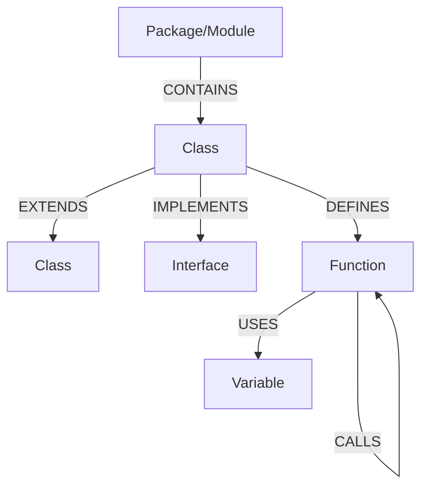
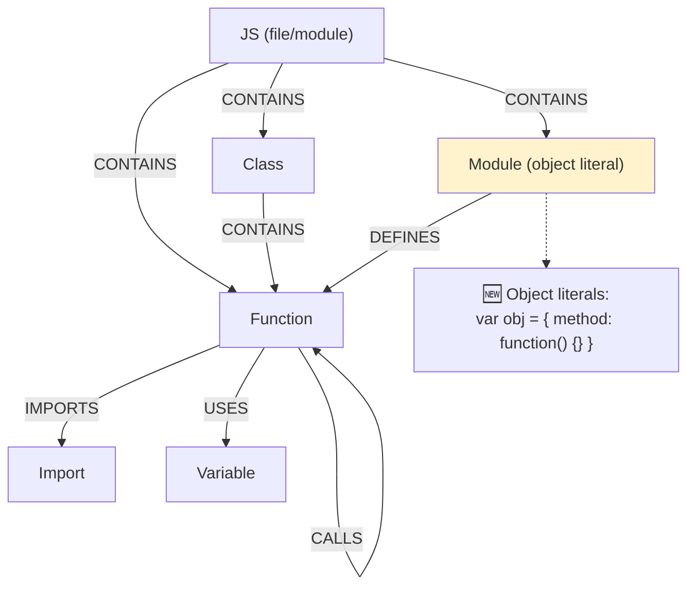
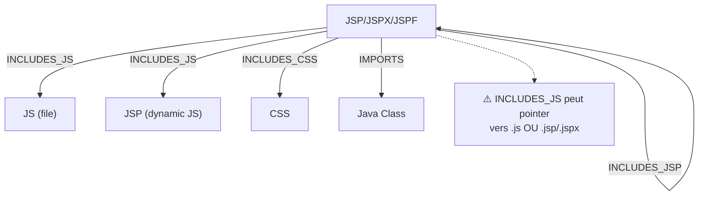
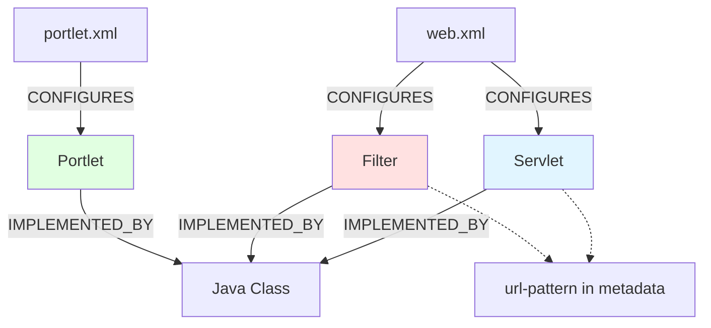

# Schéma Neo4j - Code Graph RAG Rust

Documentation complète du modèle de données Neo4j. **Basé sur le code réel de `neo4j_exporter.rs`.**

---

## 📊 Schéma global

### ☕ Java Ecosystem



### 🌐 JavaScript Ecosystem



### 🌐 JSP Ecosystem



### 🏭 WebSphere Ecosystem



---

## 🏷️ Types de nœuds (Labels Neo4j)

Tous les nœuds héritent du label `:Node` + un label spécifique.

### Propriétés communes à TOUS les nœuds

```
{
  id:             String    # Identifiant unique qualifié (ex: "com.app.UserService.getUser")
  name:           String    # Nom du nœud (ex: "getUser", "UserService")
  node_type:      String    # Type (voir tableau ci-dessous)
  language:       String    # Langue source ("java", "javascript", "python", "rust")
  file_path:      String    # Chemin du fichier source
  module:         String    # Module/Package (optionnel)
  package:        String    # Package (pour Java)
  class:          String    # Classe contenante (pour méthodes)
  caller_id:      String    # ID du contexte d'appel (optionnel)
  object_type:    String    # Type d'objet (optionnel)
  start_line:     Integer   # Ligne de début dans le fichier
  start_col:      Integer   # Colonne de début
  end_line:       Integer   # Ligne de fin
  end_col:        Integer   # Colonne de fin
}
```

### Tableau des labels

| Label | Description | Exemple |
|-------|-------------|---------|
| `:Function` | Fonction/Méthode | `getUser()`, `calculateTotal()` |
| | _Metadata `object_method: true`_ si méthode d'object literal JS | `obj.method = function(){}` |
| `:Class` | Classe/Type | `UserService`, `User` |
| `:Interface` | Interface | `IUserRepository` |
| `:Module` | Module/Namespace ou **Object Literal** (JS) | `controllers`, `compasNotification` |
| | _Metadata `object_literal: true`_ si object literal JS | `var obj = { method: function(){} }` |
| `:Package` | Package Java | `com.app.services` |
| `:Import` | Import/require | `import { Component }` |
| `:Variable` | Variable locale | `count`, `userData` |
| `:Parameter` | Paramètre de fonction | `userId`, `request` |
| `:Type` | Type custom | `Result<T>`, `Promise<Data>` |
| `:Trait` | Trait/Mixin | `Serializable` (Rust) |
| `:Expression` | Expression | Assignations, opérations |
| `:Operator` | Opérateur | `+`, `-`, `==` |
| `:JS` | Fichier/Module JavaScript (point d’ancrage des classes et fonctions) | `web/app.js` |
| **WebSphere** | |  |
| `:PortletXml` | Fichier `portlet.xml` | Configuration Portlet |
| `:WebXml` | Fichier `web.xml` | Configuration Web |
| `:Portlet` | Portlet déclaré | Dans `portlet.xml` |
| `:Servlet` | Servlet déclaré | Dans `web.xml` |
| `:Filter` | Filter déclaré | Dans `web.xml` |
| `:Jsp` | Fichier JSP | `index.jsp`, `header.jspf`, `footer.jspx` |

---

## 🔗 Relations (EdgeRelation)

### Matrice des relations principales

| Relation | De → Vers | Signification | Exemple |
|----------|-----------|---------------|---------|
| **CALLS** | Function → Function | Appel direct | `UserService.delete()` → `Database.remove()` |
| | | _Métadonnées: call_type="ajax", method="POST"_ | _JavaScript → Servlet via AJAX_ |
| | | _Métadonnées: call_type="service"_ | _Portlet → Service_ |
| | | _Métadonnées: call_type="dao", operation="QUERY"_ | _Service → DAO_ |
| **DEFINES** | Class → Function | Classe définit une méthode | `UserService` → `getUser()` |
| | Module (object literal) → Function | Object literal définit ses méthodes | `compasNotification` → `chargeActeur()` |
| **CONTAINS** | JS/Module → Class/Function | Un fichier JS (:JS) ou un module contient classes et/ou fonctions top-level | `web/app.js` → `init`, `controllers` → `UserController` |
| **IMPORTS** | Function/Class → Import | Import/require utilisé | `Controller` → `@Component` |
| **EXTENDS** | Class → Class | Héritage | `AdminService` → `UserService` |
| **IMPLEMENTS** | Class → Interface | Implémentation | `UserServiceImpl` → `IUserService` |
| **IMPLEMENTED_BY** | Interface → Class | Inverse de IMPLEMENTS | `IUserService` → `UserServiceImpl` |
| | Portlet/Servlet/Filter → Class | Implémentation de composant WebSphere | `UserPortlet` → `com.app.UserPortletImpl` |
| **USES** | Function → Variable | Fonction utilise une variable | `getUser()` → `userData` |
| **HAS_PARAM** | Function → Parameter | Fonction a un paramètre | `getUser()` → `userId` |
| **RETURNS** | Function → Type | Fonction retourne un type | `getUser()` → `User` |
| **ASSIGNED_BY** | Variable → Expression | Variable assignée par expression | `count` ← `x + 1` |
| **TRIGGERS** | Function → Node | Fonction déclenche un nœud | `onClick()` → `submitForm()` |
| **REFERENCES** | Node → Definition | Référence une définition | `userRef` → `User` |
| **HAS_TYPE** | Node → Type | Nœud a un type | `userData` → `UserData` |
| **DECLARE_TYPE** | Node → Type | Nœud déclare un type | `User` → type definition |
| **EXPORTS** | Module → Symbol | Expose un symbole | `module` → `getUser` |
| **CONFIGURES** | PortletXml/WebXml → Portlet/Servlet/Filter | XML configure composant | `portlet.xml` → `UserPortlet` |
| **DECLARES** | WebXml → Servlet | web.xml déclare Servlet | `web.xml` → `UserServlet` |
| **FILTERS** | Filter → Servlet | Filter filtre Servlet | `AuthFilter` → `UserServlet` |
| **RENDERS** | Portlet → JSP | Portlet rend une JSP | `UserPortlet` → `user.jsp` |
| **INCLUDES_JS** | JSP → JS ou JSP | JSP inclut JavaScript (fichier .js) ou JSP dynamique (fichier .jsp/.jspx générant du JS) | `index.jsp` → `app.js` ou `index.jsp` → `config.jsp` |
| **INCLUDES_CSS** | JSP → CSS | JSP inclut CSS | `index.jsp` → `style.css` |
| **INCLUDES_JSP** | JSP → JSP | Inclusion JSP | `layout.jsp` → `header.jspf` |
| **NOTIFIES** | Service → Service | Service envoie notification | `OrderService` → `EmailService` |
| **DEPENDS_ON** | JS → JS | JavaScript dépend d'un autre | `app.js` → `utils.js` |
| **BINDS_DATA** | JSP ↔ JS | JSP et JS partagent données | `form.jsp` ↔ `validator.js` |
| **TARGETS_ELEMENT** | JS → DOM | JavaScript cible élément DOM | `app.js` → `#submitBtn` |
  ├─ Class: UserService
  │   │
  │   ├─ Function: getUser(userId: int)
  │   │   └─ CALLS → UserRepository.findById()
  │   │
  │   ├─ Function: deleteUser(userId: int)
  │   │   └─ CALLS → Database.delete()
  │   │
  │   └─ USES → logger: Logger
  │
  └─ Class: UserRepository implements IUserRepository
      └─ Function: findById(id: int)
         └─ USES → Connection
```

### Exemple de nœuds Java

**Classe**
```json
{
  "id": "com.app.services.UserService",
  "name": "UserService",
  "node_type": "Class",
  "language": "java",
  "file_path": "src/main/java/com/app/services/UserService.java",
  "package": "com.app.services",
  "start_line": 10,
  "end_line": 120
}
```

**Méthode**
```json
{
  "id": "com.app.services.UserService.getUser",
  "name": "getUser",
  "node_type": "Function",
  "language": "java",
  "file_path": "src/main/java/com/app/services/UserService.java",
  "class": "UserService",
  "package": "com.app.services",
  "start_line": 25,
  "end_line": 35
}
```

### Relations de définition et de type

```cypher
# Fonction a des paramètres
MATCH (f:Function)-[:HAS_PARAM]->(p:Parameter)
WHERE f.name = "getUser"
RETURN p.name, p.node_type

# Fonction retourne un type
MATCH (f:Function)-[:RETURNS]->(t:Type)
WHERE f.name = "getUser"
RETURN t.name

# Variable a un type
MATCH (v:Variable)-[:HAS_TYPE]->(t:Type)
RETURN v.name, t.name

# Variable assignée par expression
MATCH (v:Variable)-[:ASSIGNED_BY]->(e:Expression)
RETURN v.name, e.node_type
```

### Relations Java

```cypher
# Classe contient une méthode
MATCH (class:Class {name: "UserService"})-[:DEFINES]->(method:Function {name: "getUser"})

# Appel de méthode
MATCH (caller:Function)-[:CALLS]->(callee:Function)
WHERE caller.id = "com.app.services.UserService.getUser"

# Héritage/Implémentation
MATCH (impl:Class)-[:IMPLEMENTS]->(iface:Interface)
WHERE impl.name = "UserServiceImpl"

# Méthode utilise variable
MATCH (method:Function)-[:USES]->(var:Variable)
WHERE method.name = "getUser"
```

---

## 🌐 JAVASCRIPT / TYPESCRIPT

### Structure typique

```
Module: controllers
  │
  ├─ Class: UserController
  │   │
  │   ├─ Function: getUser(req, res)
  │   │   └─ CALLS → UserService.findById()
  │   │   └─ CALLS → res.json()
  │   │
  │   └─ USES → UserService
  │
  ├─ Function: validateUser(data)
  │   └─ CALLS → validator.check()
  │
  └─ Import: Component (from React)
```

### Exemple de nœuds JavaScript

Chaque fichier JavaScript crée un nœud `:JS` (le « module » fichier) qui peut contenir des classes **et** des fonctions top-level via des arêtes `CONTAINS`.

**Fonction**
```json
{
  "id": "controllers::getUser",
  "name": "getUser",
  "node_type": "Function",
  "language": "javascript",
  "file_path": "src/controllers/user-controller.ts",
  "module": "controllers",
  "start_line": 12,
  "end_line": 25
}
```

**Fichier / Module JS**
```json
{
  "id": "web/app.js::module",
  "name": "web/app.js",
  "node_type": "JS",
  "language": "javascript",
  "file_path": "web/app.js",
  "start_line": 1,
  "end_line": 200
}
```

**Classe**
```json
{
  "id": "controllers::UserController",
  "name": "UserController",
  "node_type": "Class",
  "language": "javascript",
  "file_path": "src/controllers/user-controller.ts",
  "module": "controllers",
  "start_line": 5,
  "end_line": 50
}
```

**Import**
```json
{
  "id": "controllers::Component",
  "name": "Component",
  "node_type": "Import",
  "language": "javascript",
  "file_path": "src/controllers/user-controller.ts",
  "start_line": 1,
  "end_line": 1
}
```

### Relations JavaScript

```cypher
# Appel de fonction
MATCH (caller:Function)-[:CALLS]->(callee:Function)
WHERE caller.name = "getUser"

# Import utilisé
MATCH (func:Function)-[:IMPORTS]->(imp:Import)
WHERE imp.name = "Component"

# Classe contient fonction
MATCH (cls:Class)-[:CONTAINS]->(fn:Function)
WHERE cls.name = "UserController"

# Fonction utilise variable
MATCH (fn:Function)-[:USES]->(var:Variable)
WHERE var.name = "userData"
```

---

## 🌐 JSP

### Types et structures

**Rappel sur les inclusions JS :** `INCLUDES_JS` relie un nœud `:Jsp` vers :
- Un nœud `:Js` représentant un fichier JavaScript standard (.js)
- **OU** un nœud `:Jsp` représentant un fichier JSP dynamique (.jsp/.jspx/.jspf) qui génère du JavaScript

Ce cas d'usage survient lorsque des JSP génèrent dynamiquement du JavaScript (ex: configuration, traductions, données contextuelles). Le fichier est inclus via `<script src="/path/to/config.jsp"></script>` et la relation reste `INCLUDES_JS` même si la cible est un nœud `:Jsp`.

#### JSP Standard (.jsp)

```
File: index.jsp
├─ HTML content
├─ INCLUDES_JS → app.js (fichier .js)
├─ INCLUDES_JS → config.jsp (fichier .jsp générant du JS dynamique)
├─ INCLUDES_CSS → style.css
└─ INCLUDES_JSP → header.jspf
```

#### JSP XML (.jspx)

```
File: form.jspx
├─ XML bien formé
├─ INCLUDES_JS → validators.js
└─ INCLUDES_JSP → footer.jspf
```

#### JSP Fragment (.jspf)

```
File: header.jspf
├─ Fragment réutilisable
├─ NO INCLUDES_JS/CSS (inclus par parent)
└─ Peut être inclus par d'autres JSP
```

### Exemple de nœuds JSP

**Fichier JSP**
```json
{
  "id": "web/index.jsp",
  "name": "index.jsp",
  "node_type": "Jsp",
  "language": "jsp",
  "file_path": "src/main/webapp/index.jsp",
  "start_line": 1,
  "end_line": 50
}
```

**Fragment JSP**
```json
{
  "id": "web/components/header.jspf",
  "name": "header.jspf",
  "node_type": "Jsp",
  "language": "jspf",
  "file_path": "src/main/webapp/components/header.jspf",
  "start_line": 1,
  "end_line": 20
}
```

### Relations JSP

```cypher
# JSP inclut JavaScript (fichier .js)
MATCH (jsp:Jsp)-[:INCLUDES_JS]->(js:Js)
WHERE jsp.name = "index.jsp"
RETURN js.file_path

# JSP inclut un fichier JSP dynamique générant du JavaScript
MATCH (jsp:Jsp)-[:INCLUDES_JS]->(dynamic:Jsp)
WHERE jsp.name = "index.jsp"
RETURN dynamic.file_path

# JSP inclut un autre JSP
MATCH (parent:Jsp)-[:INCLUDES_JSP]->(child:Jsp)
WHERE parent.name = "index.jsp"

# JSP inclut CSS
MATCH (jsp:Jsp)-[:INCLUDES_CSS]->(css)
WHERE jsp.name = "form.jspx"
```

---

## 🏭 WEBSPHERE - Configuration

### Architecture de déploiement

```
WEB-INF/
├─ web.xml (Servlets, Filters)
│   └─ CONFIGURES →
│       ├─ Servlet: UserServlet
│       ├─ Servlet: AdminServlet
│       └─ Filter: AuthFilter
│
└─ portlet.xml (Portlets)
    └─ CONFIGURES →
        ├─ Portlet: UserPortlet
        └─ Portlet: DashboardPortlet
```

### web.xml - Servlets et Filters

**Servlets déclarés**

```json
{
  "id": "servlet::UserServlet",
  "name": "UserServlet",
  "node_type": "Servlet",
  "language": "xml",
  "file_path": "/servlets/UserServlet.java",
  "metadata": {
    "class": "com.app.servlet.UserServlet",
    "url-pattern": "/user/*"
  },
  "start_line": 1,
  "end_line": 1
}
```

**Filters déclarés**

```json
{
  "id": "filter::AuthFilter",
  "name": "AuthFilter",
  "node_type": "Filter",
  "language": "xml",
  "file_path": "/filters/AuthFilter.java",
  "metadata": {
    "class": "com.app.filter.AuthFilter",
    "url-pattern": "/*"
  },
  "start_line": 1,
  "end_line": 1
}
```

**Fichier web.xml lui-même**

```json
{
  "id": "config::web.xml",
  "name": "web.xml",
  "node_type": "WebXml",
  "language": "xml",
  "file_path": "WEB-INF/web.xml",
  "metadata": {
    "type": "deployment-descriptor"
  },
  "start_line": 1,
  "end_line": 1
}
```

### portlet.xml - Portlets

**Portlets déclarés**

```json
{
  "id": "portlet::UserPortlet",
  "name": "UserPortlet",
  "node_type": "Portlet",
  "language": "xml",
  "file_path": "/portlets/UserPortlet.java",
  "metadata": {
    "class": "com.app.portlet.UserPortlet"
  },
  "start_line": 1,
  "end_line": 1
}
```

**Fichier portlet.xml lui-même**

```json
{
  "id": "config::portlet.xml",
  "name": "portlet.xml",
  "node_type": "PortletXml",
  "language": "xml",
  "file_path": "WEB-INF/portlet.xml",
  "metadata": {
    "type": "deployment-descriptor"
  },
  "start_line": 1,
  "end_line": 1
}
```

### Relations WebSphere

```cypher
# web.xml configure les servlets
MATCH (xml:WebXml)-, servlet.metadata.`url-pattern`

# Servlet implémenté par une classe Java
MATCH (servlet:Servlet)-[:IMPLEMENTED_BY]->(cls:Class)
WHERE servlet.name = "UserServlet"
RETURN servlet.metadata.`url-pattern`, cls.id, cls.file_path

# Trouver les servlets par url-pattern
MATCH (servlet:Servlet)-[:IMPLEMENTED_BY]->(cls:Class)
WHERE servlet.metadata.`url-pattern` IN ['/user/*', '/admin/*']
RETURN servlet.name, servlet.metadata.`url-pattern`, cls.id

# portlet.xml configure les portlets
MATCH (xml:PortletXml)-[:CONFIGURES]->(portlet:Portlet)
WHERE xml.name = "portlet.xml"
RETURN portlet.name

# Portlet implémenté par une classe Java
MATCH (portlet:Portlet)-[:IMPLEMENTED_BY]->(cls:Class)
RETURN portlet.name, cls.id, cls.file_path

# Filtre assure l'authentification (chaîne)
MATCH (filter:Filter)-[:IMPLEMENTED_BY]->(cls:Class)
WHERE filter.name = "AuthFilter"
RETURN filter.metadata.`url-pattern`, cls.idn (chaîne)
MATCH (filter1:Filter)-[:USES]->(filter2:Filter)
WHERE filter1.name = "AuthFilter"
```

---

## 📐 Diagramme des relations par type

### Java Ecosystem

```
Package
  ↓ CONTAINS
Class ←─ EXTENDS ─→ Class
  ↓ DEFINES           ↓ IMPLEMENTS
Function        Interface
  ↓ CALLS
Function (autre classe)
  ↓ USES
Variable, Parameter
```

### JavaScript Ecosystem

```
Module
  ↓ CONTAINS
Class/Function ←─ IMPORTS ─→ Import
  ↓ CALLS
Function (autre module)
  ↓ USES
Variable, Parameter
```

### JSP Ecosystem

**Relations JSP:**
- `INCLUDES_JS` : JSP → fichier JavaScript
- `INCLUDES_CSS` : JSP → fichier CSS  
- `INCLUDES_JSP` : JSP → autre JSP/JSPF (inclusion statique ou dynamique)
- `IMPORTS` : JSP → Java Class (imports de beans via `<%@page import="..."%>`)

**Exemple d'architecture JSP :**
```
gestion_ep.jsp
  ├─ INCLUDES_JS → /resources/js/app.js
  ├─ INCLUDES_CSS → /resources/css/style.css
  ├─ INCLUDES_JSP → includes/fragment.jspf (static)
  │   └─ INCLUDES_JSP → sub/nested-fragment.jspf
  └─ IMPORTS → com.example.portal.fo.web.portlets.synthese.GestionEPSessionBean
  └─ IMPORTS → com.example.portal.fo.util.Constantes
```

---

### WebSphere Ecosystem

```
web.xml
  ↓ CONFIGURES
Servlet/Filter ─ IMPLEMENTED_BY → Java Class
  ↓ USES
  Java Service (via CALLS)

portlet.xml
  ↓ CONFIGURES
Portlet ─ IMPLEMENTED_BY → Java Portlet Class
  ↓ USES
  Java Service (via CALLS)class

# Trouver les servlets par url-pattern
MATCH (s:Servlet)-[:IMPLEMENTED_BY]->(c:Class)
WHERE s.metadata.`url-pattern` IN ['/ErreurSigma.srv', '/TarifPjServlet.srv']
RETURN s.metadata.`url-pattern` AS url, c.id AS implementing_class, c.file_path
```

---

## 🎯 Cas d'usage pratiques

### Trouver tous les servlets

```cypher
# Tous les servlets avec leurs métadonnées
MATCH (web:WebXml)-[:CONFIGURES]->(servlet:Servlet)
RETURN web.file_path, servlet.name, servlet.metadata.class, servlet.metadata.`url-pattern`

# Trouver les servlets par url-pattern
MATCH (s:Servlet)-[:IMPLEMENTED_BY]->(c:Class)
WHERE s.metadata.`url-pattern` IN ['/ErreurSigma.srv', '/TarifPjServlet.srv', '/PropositionPjServlet.srv']
RETURN s.metadata.`url-pattern` AS url, c.id AS implementing_class, c.file_path

# Tous les servlets avec extension .srv
MATCH (s:Servlet)-[:IMPLEMENTED_BY]->(c:Class)
WHERE s.metadata.`url-pattern` ENDS WITH '.srv'
RETURN s.name, s.metadata.`url-pattern`, c.id
```

### Trouver le flux d'appels complet

```cypher
MATCH path = (start:Function)-[:CALLS*1..5]->(end:Function)
WHERE start.name = "getUser"
RETURN path
```

### Trouver les JSP orphelines (non incluses)

```cypher
MATCH (jsp:Jsp)
WHERE NOT (()-[:INCLUDES_JSP]->(jsp))
AND jsp.name LIKE "%.jsp"
RETURN jsp.file_path
```ED_BY]->(cls:Class)
MATCH (cls)-[:CONTAINS]->(method:Function)-[:CALLS*]->(target:Function)
RETURN DISTINCT portlet.name, target.name

# Portlet → Service → DAO chain avec métadonnées
MATCH (portlet:Portlet)-[:IMPLEMENTED_BY]->(cls:Class)
MATCH (cls)-[:CONTAINS]->(method:Function)
MATCH (method)-[c1:CALLS]->(service:Function)-[c2:CALLS]->(dao:Function)

# Portlet → Service → DAO chain avec métadonnées
MATCH (portlet:Portlet)-[c1:CALLS]->(service:Function)
      -[c2:CALLS]->(dao:Function)
WHERE c1.call_type = "service" AND c2.call_type = "dao"
RETURN portlet.name, service.name, dao.name

# Portlet rend une JSP
MATCH (portlet:Portlet)-[:RENDERS]->(jsp:Jsp)
RETURN portlet.name, jsp.file_path
```

### Analyser les appels AJAX

```cypher
# JavaScript appelle Servlet via AJAX (filtrer par call_type)
MATCH (js:Function)-[c:CALLS]->(servlet:Servlet)
WHERE c.call_type = "ajax"
RETURN js.name, servlet.name, c.method AS http_method, c.async

# Trouver tous les appels AJAX GET
MATCH (caller)-[c:CALLS]->(target)
WHERE c.call_type = "ajax" AND c.method = "GET"
RETURN caller.name, target.name, c.url

# JavaScript dépend d'autres JS
MATCH (js1:JS)-[:DEPENDS_ON]->(js2:JS)
RETURN js1.file_path, js2.file_path
``` (par url-pattern)
MATCH (filter:Filter), (servlet:Servlet)
WHERE filter.metadata.`url-pattern` = servlet.metadata.`url-pattern`
   OR filter.metadata.`url-pattern` = "/*"
RETURN filter.name, servlet.name, servlet.metadata.`url-pattern`

# Servlet déclaré dans web.xml avec sa classe d'implémentation
MATCH (xml:WebXml)-[:CONFIGURES]->(servlet:Servlet)-[:IMPLEMENTED_BY]->(cls:Class)
RETURN servlet.name, servlet.metadata.`url-pattern`, cls.id, cls.file_path
RETURN filter.name, servlet.name, servlet.metadata.`url-pattern`

# Servlet déclaré dans web.xml
MATCH (xml:WebXml)-[:DECLARES]->(servlet:Servlet)
RETURN servlet.name, servlet.metadata.`servlet-class`
```

### Trouver les fichiers JS inclus par des JSP

```cypher
MATCH (jsp:Jsp)-[:INCLUDES_JS]->(js:JS)
RETURN jsp.file_path, js.file_path
ORDER BY jsp.file_path
```

---IMPLEMENTED_BY, CALLS | INCLUDES_JS, INCLUDES_JSP, BINDS_DATA |
| **Fichiers** | `.java` | `.ts`, `.js` | `web.xml`, `portlet.xml` | `.jsp`, `.jspx`, `.jspf` |
| **Package/Module** | `com.app.services` | `controllers`, `models` | N/A | N/A |
| **Propriété unique** | `package`, `class` | `module` | `metadata.class`, `metadata.url-pattern
| Aspect | Java | JavaScript | WebSphere | JSP |
|--------|------|-----------|-----------|-----|
| **Label principal** | `:Class`, `:Function` | `:Class`, `:Function`, `:JS` | `:Servlet`, `:Portlet`, `:Filter` | `:Jsp` |
| **Relations clés** | CALLS, EXTENDS, IMPLEMENTS, HAS_PARAM, RETURNS | CALLS, IMPORTS, USES, DEPENDS_ON | CONFIGURES, DECLARES, FILTERS, CALLS (avec call_type) | INCLUDES_JS, INCLUDES_JSP, BINDS_DATA |
| **Fichiers** | `.java` | `.ts`, `.js` | `web.xml`, `portlet.xml` | `.jsp`, `.jspx`, `.jspf` |
| **Package/Module** | `com.app.services` | `controllers`, `models` | N/A | N/A |
| **Propriété unique** | `package`, `class` | `module` | `metadata` | Attributs de fichier |

---

## 🔗 Récapitulatif complet des relations

### Relations de définition et structure
- **DEFINES** : Class → Function (définition de méthode)
- **CONTAINS** : Class/Module/JS → Function/Class (contenance)
- **HAS_PARAM** : Function → Parameter
- **RETURNS** : Function → Type
- **DECLARE_TYPE** : Node → Type

### Relations d'appel et déclenchement
- **CALLS** : Function → Function (générique, voir métadonnées pour type d'appel)
  - `call_type="standard"` : Appel classique
  - `call_type="ajax"` : Appel AJAX (JS → Servlet)
  - `call_type="service"` : Appel service (Portlet → Service)
  - `call_type="dao"` : Appel DAO (Service → DAO)
- **TRIGGERS** : Function → Node

### Relations de dépendance
- **IMPORTS** : Function/Class → Import
- **USES** : Function → Variable
- **REFERENCES** : Node → Definition
- **DEPENDS_ON** : JS → JS

### Relations de type et héritage
- **EXTENDS** : Class → Class
- **IMPLEMENTS** : Class → Interface
- **IMPLEMENTED_BY** : Interface → Class
- **IMPLEMENTED_BY** : Portlet/Servlet/Filter → Class
- **HAS_TYPE** : Node → Type

### Relations d'assignation et visibilité
- **ASSIGNED_BY** : Variable → Expression
- **EXPORTS** : Module → Symbol

### IMPLEMENTED_BY** : Servlet/Portlet/Filter → Class (implémentation Java)tXml → Servlet/Portlet/Filter
- **DECLARES** : WebXml → Servlet
- **FILTERS** : Filter → Servlet
- **RENDERS** : Portlet → JSP
- **NOTIFIES** : Service → Service

### Relations JSP
- **INCLUDES_JS** : JSP → JS
- **INCLUDES_CSS** : JSP → CSS
- **INCLUDES_JSP** : JSP → JSP
- **BINDS_DATA** : JSP ↔ JS

### Relations DOM
- **TARGETS_ELEMENT** : JS → DOM

---

## ✅ Cohérence du schéma

- ✅ **Identifiants uniques** : Chaque nœud a un `id` qualifié unique
- ✅ **Traçabilité** : `file_path`, `start_line`, `end_line` permettent de retrouver le code source
- ✅ **Contexte complet** : Métadonnées couvrent package, classe, module
- ✅ **Relations bidirectionnelles** : IMPLEMENTS ↔ IMPLEMENTED_BY
- ✅ **Flexibilité** : Propriétés optionnelles (`caller_id`, `object_type`, `metadata`)

---

*Schéma généré depuis `neo4j_exporter.rs` - January 19, 2026*
