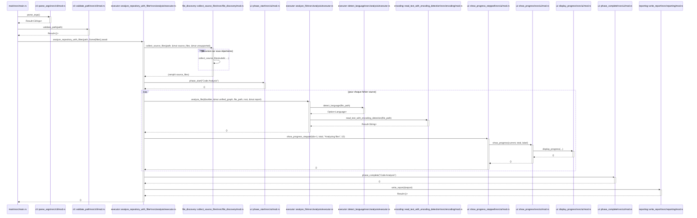

# Simple usage

Using Claude Slash command :

```
/seq-diagram   function main of main.rs
```

# Cyphers

**1. Locate the `main` function in `main.rs`**
```cypher
MATCH (f:Function)
WHERE f.language = 'rust' AND f.name = 'main' AND f.file_path CONTAINS 'main.rs'
OPTIONAL MATCH (f)-[:CALLS]->(callee:Function)
RETURN f.id, f.name, collect(callee.name) AS callees
```

**2. Full recursive call graph from `main` (all depths)**
```cypher
MATCH path = (start:Function)-[:CALLS*1..15]->(end:Function)
WHERE start.id = '/workspaces/code-continuum/src/main.rs::function:main'
WITH DISTINCT
  [n IN nodes(path) | n.id]       AS node_ids,
  [n IN nodes(path) | n.name]     AS node_names,
  [n IN nodes(path) | n.file_path] AS node_files,
  length(path) AS depth
RETURN node_ids, node_names, node_files, depth
ORDER BY depth
```

**3. All CALLS edges reachable from `main`**
```cypher
MATCH path = (start:Function)-[:CALLS*1..15]->(caller:Function)-[:CALLS]->(callee:Function)
WHERE start.id = '/workspaces/code-continuum/src/main.rs::function:main'
RETURN DISTINCT
  caller.name AS from, caller.id AS from_id,
  callee.name AS to,   callee.id AS to_id
ORDER BY from, to
```

**4. Direct CALLS from `main`**
```cypher
MATCH (main:Function)-[:CALLS]->(callee:Function)
WHERE main.id = '/workspaces/code-continuum/src/main.rs::function:main'
RETURN main.name AS from, callee.name AS to, callee.id AS to_id, callee.file_path AS to_file
```

**5. Leaf functions (out-degree = 0) reachable from `main`**
```cypher
MATCH (start:Function)-[:CALLS*1..15]->(f:Function)
WHERE start.id = '/workspaces/code-continuum/src/main.rs::function:main'
WITH DISTINCT f
OPTIONAL MATCH (f)-[:CALLS]->(callee:Function)
RETURN f.name, f.file_path, count(callee) AS out_degree
ORDER BY out_degree DESC, f.name
```

# Result

> Generated after fix of `src/graph_builder/dsl_executor/rust_extractor.rs` and `src/graph_builder/dsl_executor/mod.rs`.



**Leaf functions (out-degree = 0):** `parse_args`, `validate_path`, `detect_language`, `read_text_with_encoding_detection`, `phase_start`, `phase_complete`, `display_progress`, `write_report`.

**Recursive call:** `collect_source_files → collect_source_files` (directory traversal).

**Remaining gaps** (resolved edges not yet indexed — residual extractor limitations):

| Missing edge | Reason |
|---|---|
| `main → test_connection` | Two functions named `test_connection` in the project → ambiguous, cross-file fallback not triggered |
| `main → PackageFilter::with_patterns / ::default` | Cross-file type-qualified call (`PackageFilter` defined outside `main.rs`) — filtered as external by the local-types heuristic |
| `analyze_repository_with_filter → MultiLanguageGraphBuilder::new`, `UnifiedGraph::new`, `DependencyResolver::*`, `DslExecutor::*`, `Neo4jExporter::*` | Same cause: ambiguous `new` or types defined in other files |
| `analyze_file → DslRegistry::get_tree_sitter_language`, `builder.build_graph` | Same cause |
