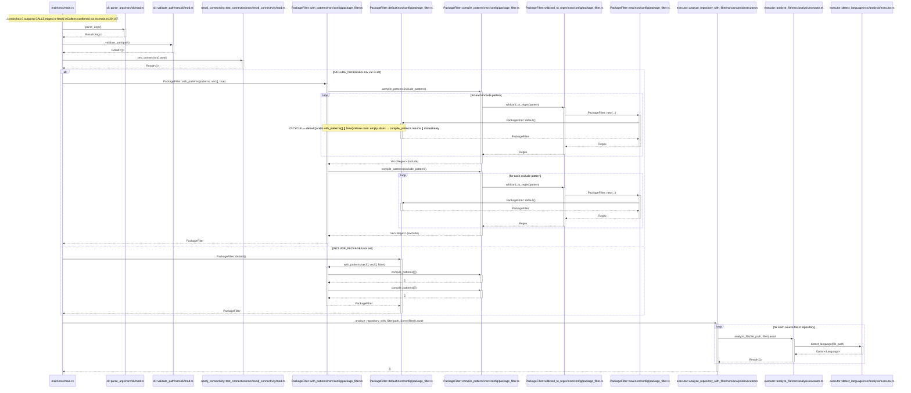

# Simple usage

Using Claude Slash command :

```
/seq-diagram   function main of main.rs
```

# Cyphers

**1. Locate the `main` function in `main.rs`**
```cypher
MATCH (f:Function)
WHERE f.language = 'rust' AND f.name = 'main' AND f.file_path CONTAINS 'main.rs'
RETURN f.id, f.name, f.file_path, f.start_line, f.end_line
```

**2. Check direct CALLS edges from `main`**
```cypher
MATCH (caller:Function)-[:CALLS]->(callee:Function)
WHERE caller.id = '/workspaces/code-continuum/src/main.rs::function:main'
RETURN caller.name, callee.name, callee.id, callee.file_path, callee.start_line
```

**3. Recursive call graph from known entry points (up to depth 15)**
```cypher
MATCH path = (start:Function)-[:CALLS*0..15]->(end:Function)
WHERE start.language = 'rust' AND start.name IN [
  'parse_args', 'validate_path', 'test_connection',
  'with_patterns', 'analyze_repository_with_filter'
]
WITH DISTINCT start, end, min(length(path)) AS depth
RETURN start.name AS entry, end.name AS callee, end.id AS callee_id, end.file_path AS callee_file, depth
ORDER BY entry, depth
```

**4. All CALLS edges reachable from entry points**
```cypher
MATCH (caller:Function)-[r:CALLS]->(callee:Function)
WHERE caller.language = 'rust' AND caller.name IN [
  'parse_args', 'validate_path', 'test_connection',
  'with_patterns', 'analyze_repository_with_filter',
  'analyze_file', 'detect_language', 'compile_patterns', 'wildcard_to_regex', 'new', 'default'
]
RETURN DISTINCT
  caller.name AS from, caller.id AS from_id,
  callee.name AS to, callee.id AS to_id,
  callee.file_path AS to_file
ORDER BY from, to
```

**5. Direct callees of `analyze_repository_with_filter`**
```cypher
MATCH (caller:Function)-[:CALLS]->(callee:Function)
WHERE caller.id = '/workspaces/code-continuum/src/analysis/executor.rs::function:analyze_repository_with_filter'
RETURN caller.name, callee.name, callee.id, callee.file_path
```

**6. Direct callees of `analyze_file`**
```cypher
MATCH (caller:Function)-[:CALLS]->(callee:Function)
WHERE caller.id = '/workspaces/code-continuum/src/analysis/executor.rs::function:analyze_file'
RETURN caller.name, callee.name, callee.id, callee.file_path
```

**7. All CALLS edges in `package_filter.rs`**
```cypher
MATCH (caller:Function)-[:CALLS]->(callee:Function)
WHERE caller.file_path CONTAINS 'package_filter.rs'
RETURN caller.name, caller.id, callee.name, callee.id
ORDER BY caller.name
```

**8. Confirm leaf functions (out-degree = 0)**
```cypher
MATCH (f:Function)
WHERE f.language = 'rust'
  AND f.name IN ['parse_args','validate_path','detect_language']
  AND f.file_path IN [
    '/workspaces/code-continuum/src/cli/mod.rs',
    '/workspaces/code-continuum/src/analysis/executor.rs'
  ]
OPTIONAL MATCH (f)-[:CALLS]->(callee:Function)
RETURN f.name, f.file_path, count(callee) AS out_degree
```

# Result



# Correction

Vérification effectuée en lisant les sources (`src/main.rs`, `src/analysis/executor.rs`, `src/config/package_filter.rs`, `src/cli/mod.rs`, `src/neo4j_connectivity/mod.rs`).

## Erreurs du résultat Neo4j

| # | Erreur | Cause |
|---|--------|-------|
| 1 | `wildcard_to_regex → PackageFilter::new` | **Artefact Neo4j** : le code appelle `Regex::new()` (crate externe `regex`), pas `PackageFilter::new`. Aucun cycle n'existe. |
| 2 | Participant `PackageFilter::new` inutile | N'est pas appelé depuis le chemin `main`. |
| 3 | Note "CYCLE" incorrecte | Supprimée — basée sur l'edge erronée ci-dessus. |

## Omissions du résultat Neo4j

Ces appels existent dans le source mais sont absents du graphe Neo4j (couverture incomplète de l'indexation).

**Dans `analyze_repository_with_filter`** (executor.rs:104–234) :

| Callee manquant | Localisation |
|-----------------|--------------|
| `file_discovery::collect_source_files` | src/file_discovery/mod.rs |
| `MultiLanguageGraphBuilder::new` | src/graph_builder/builder.rs |
| `UnifiedGraph::new` | src/semantic_graph/semantic_graph.rs |
| `ui::phase_start` / `phase_complete` | src/ui/mod.rs |
| `ui::show_progress_stepped` | src/ui/mod.rs |
| `DependencyResolver::with_filter` / `::new` | src/graph_builder/dsl_executor/dependency_resolver.rs |
| `DslExecutor::register_local_classes` | src/graph_builder/dsl_executor/mod.rs |
| `DslExecutor::resolve_imports_global` | src/graph_builder/dsl_executor/mod.rs |
| `DslExecutor::resolve_extends_implements_global` | src/graph_builder/dsl_executor/mod.rs |
| `DslExecutor::resolve_calls_global` | src/graph_builder/dsl_executor/mod.rs |
| `UnifiedGraph::print_summary` | src/semantic_graph/semantic_graph.rs |
| `reporting::write_report` | src/reporting/mod.rs |
| `Neo4jExporter::new` | src/semantic_graph/neo4j_exporter.rs |
| `Neo4jExporter::export_graph` | src/semantic_graph/neo4j_exporter.rs |

**Dans `analyze_file`** (executor.rs:17–96) :

| Callee manquant | Localisation |
|-----------------|--------------|
| `encoding::read_text_with_encoding_detection` | src/encoding/mod.rs |
| `DslRegistry::get_tree_sitter_language` | src/semantic_graph/dsl.rs |
| `MultiLanguageGraphBuilder::build_graph` | src/graph_builder/builder.rs |

**Dans `detect_language`** (executor.rs:12–14) :

| Callee manquant | Localisation |
|-----------------|--------------|
| `DslRegistry::detect_language_from_path` | src/semantic_graph/dsl.rs |

## Diagramme corrigé

```mermaid
sequenceDiagram
    participant main     as main\nsrc/main.rs
    participant pa       as cli::parse_args\nsrc/cli/mod.rs
    participant vp       as cli::validate_path\nsrc/cli/mod.rs
    participant tc       as neo4j_connectivity::test_connection\nsrc/neo4j_connectivity/mod.rs
    participant pf_wp    as PackageFilter::with_patterns\nsrc/config/package_filter.rs
    participant pf_def   as PackageFilter::default\nsrc/config/package_filter.rs
    participant pf_cp    as PackageFilter::compile_patterns\nsrc/config/package_filter.rs
    participant pf_w2r   as PackageFilter::wildcard_to_regex\nsrc/config/package_filter.rs
    participant exec     as executor::analyze_repository_with_filter\nsrc/analysis/executor.rs
    participant cfs      as file_discovery::collect_source_files\nsrc/file_discovery/mod.rs
    participant bldr     as MultiLanguageGraphBuilder::new\nsrc/graph_builder/builder.rs
    participant ug       as UnifiedGraph::new\nsrc/semantic_graph/semantic_graph.rs
    participant ui       as ui::phase_start / phase_complete\nsrc/ui/mod.rs
    participant uip      as ui::show_progress_stepped\nsrc/ui/mod.rs
    participant af       as executor::analyze_file\nsrc/analysis/executor.rs
    participant dl       as executor::detect_language\nsrc/analysis/executor.rs
    participant dsl_dl   as DslRegistry::detect_language_from_path\nsrc/semantic_graph/dsl.rs
    participant enc      as encoding::read_text_with_encoding_detection\nsrc/encoding/mod.rs
    participant dsl_ts   as DslRegistry::get_tree_sitter_language\nsrc/semantic_graph/dsl.rs
    participant bg       as MultiLanguageGraphBuilder::build_graph\nsrc/graph_builder/builder.rs
    participant dep      as DependencyResolver::with_filter / ::new\nsrc/graph_builder/dsl_executor/dependency_resolver.rs
    participant rlc      as DslExecutor::register_local_classes\nsrc/graph_builder/dsl_executor/mod.rs
    participant rig      as DslExecutor::resolve_imports_global\nsrc/graph_builder/dsl_executor/mod.rs
    participant rei      as DslExecutor::resolve_extends_implements_global\nsrc/graph_builder/dsl_executor/mod.rs
    participant rcg      as DslExecutor::resolve_calls_global\nsrc/graph_builder/dsl_executor/mod.rs
    participant ugps     as UnifiedGraph::print_summary\nsrc/semantic_graph/semantic_graph.rs
    participant rpt      as reporting::write_report\nsrc/reporting/mod.rs
    participant nex      as Neo4jExporter::new\nsrc/semantic_graph/neo4j_exporter.rs
    participant exp      as Neo4jExporter::export_graph\nsrc/semantic_graph/neo4j_exporter.rs

    %% ── 1. CLI ───────────────────────────────────────────────────────────
    main->>+pa: parse_args()
    pa-->>-main: Result<CliArgs>

    main->>+vp: validate_path(path)
    vp-->>-main: Result<()>

    %% ── 2. Neo4j connectivity ────────────────────────────────────────────
    main->>+tc: test_connection().await
    Note right of tc: appelle neo4rs::Graph::new (crate externe)
    tc-->>-main: Result<()>

    %% ── 3. PackageFilter ────────────────────────────────────────────────
    alt INCLUDE_PACKAGES env var définie
        main->>+pf_wp: PackageFilter::with_patterns(patterns, vec![], true)
        pf_wp->>+pf_cp: compile_patterns(include_patterns)
        loop pour chaque pattern include
            pf_cp->>+pf_w2r: wildcard_to_regex(pattern)
            Note right of pf_w2r: appelle Regex::new() — crate externe, pas de cycle
            pf_w2r-->>-pf_cp: Regex
        end
        pf_cp-->>-pf_wp: Vec<Regex>
        pf_wp->>+pf_cp: compile_patterns(exclude_patterns)
        loop pour chaque pattern exclude
            pf_cp->>+pf_w2r: wildcard_to_regex(pattern)
            pf_w2r-->>-pf_cp: Regex
        end
        pf_cp-->>-pf_wp: Vec<Regex>
        pf_wp-->>-main: PackageFilter
    else INCLUDE_PACKAGES non définie
        main->>+pf_def: PackageFilter::default()
        pf_def->>+pf_wp: with_patterns(vec![], vec![], true)
        pf_wp->>+pf_cp: compile_patterns([])
        pf_cp-->>-pf_wp: [] (aucun pattern)
        pf_wp->>+pf_cp: compile_patterns([])
        pf_cp-->>-pf_wp: [] (aucun pattern)
        pf_wp-->>-pf_def: PackageFilter
        pf_def-->>-main: PackageFilter
    end

    %% ── 4. Analyse du dépôt ─────────────────────────────────────────────
    main->>+exec: analyze_repository_with_filter(path, Some(filter)).await

    exec->>+cfs: collect_source_files(path, &mut source_files, &mut unsupported_files)
    cfs-->>-exec: (remplit source_files)

    Note over exec: tri : non-JSP en premier, JSP/JSPX/JSPF en dernier

    exec->>+bldr: MultiLanguageGraphBuilder::new()
    bldr-->>-exec: MultiLanguageGraphBuilder

    exec->>+ug: UnifiedGraph::new()
    ug-->>-exec: UnifiedGraph

    exec->>+ui: phase_start("Code Analysis")
    ui-->>-exec: ()

    loop pour chaque fichier source
        exec->>+af: analyze_file(&builder, &mut unified_graph, file_path, root, &mut report)

        af->>+dl: detect_language(file_path)
        dl->>+dsl_dl: DslRegistry::detect_language_from_path(file_path)
        dsl_dl-->>-dl: Option<&'static str>
        dl-->>-af: Option<Language>

        af->>+enc: read_text_with_encoding_detection(file_path)
        enc-->>-af: Result<String>

        af->>+dsl_ts: DslRegistry::get_tree_sitter_language(language)
        dsl_ts-->>-af: Option<Language>

        af->>+bg: builder.build_graph(language, ts_lang, &source_code, &file_path_str)
        bg-->>-af: Result<FileGraph>

        Note over af: unified_graph.add_node / add_edge (inline)
        af-->>-exec: ()

        exec->>+uip: show_progress_stepped(idx+1, total, "Analyzing files", 10)
        uip-->>-exec: ()
    end

    exec->>+ui: phase_complete("Code Analysis")
    ui-->>-exec: ()

    %% ── 5. Résolution des dépendances ───────────────────────────────────
    alt filter fourni
        exec->>+dep: DependencyResolver::with_filter(filter)
        dep-->>-exec: DependencyResolver
    else pas de filter
        exec->>+dep: DependencyResolver::new()
        dep-->>-exec: DependencyResolver
    end

    exec->>+rlc: DslExecutor::register_local_classes(&mut resolver, &unified_graph)
    rlc-->>-exec: ()

    exec->>+rig: DslExecutor::resolve_imports_global(&mut unified_graph, &resolver)
    rig-->>-exec: ()

    exec->>+rei: DslExecutor::resolve_extends_implements_global(&mut unified_graph, &resolver)
    rei-->>-exec: ()

    exec->>+rcg: DslExecutor::resolve_calls_global(&mut unified_graph, &resolver)
    rcg-->>-exec: ()

    exec->>+ugps: unified_graph.print_summary()
    ugps-->>-exec: ()

    %% ── 6. Rapport & export Neo4j ───────────────────────────────────────
    exec->>+rpt: reporting::write_report(&report)
    rpt-->>-exec: Result<()>

    exec->>+nex: Neo4jExporter::new().await
    nex-->>-exec: Result<Neo4jExporter>

    exec->>+exp: exporter.export_graph(&unified_graph).await
    exp-->>-exec: Result<()>

    exec-->>-main: ()
```


